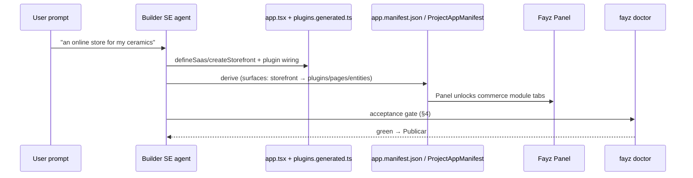
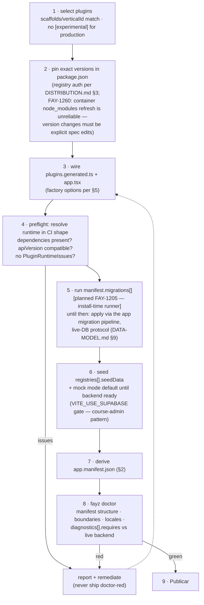
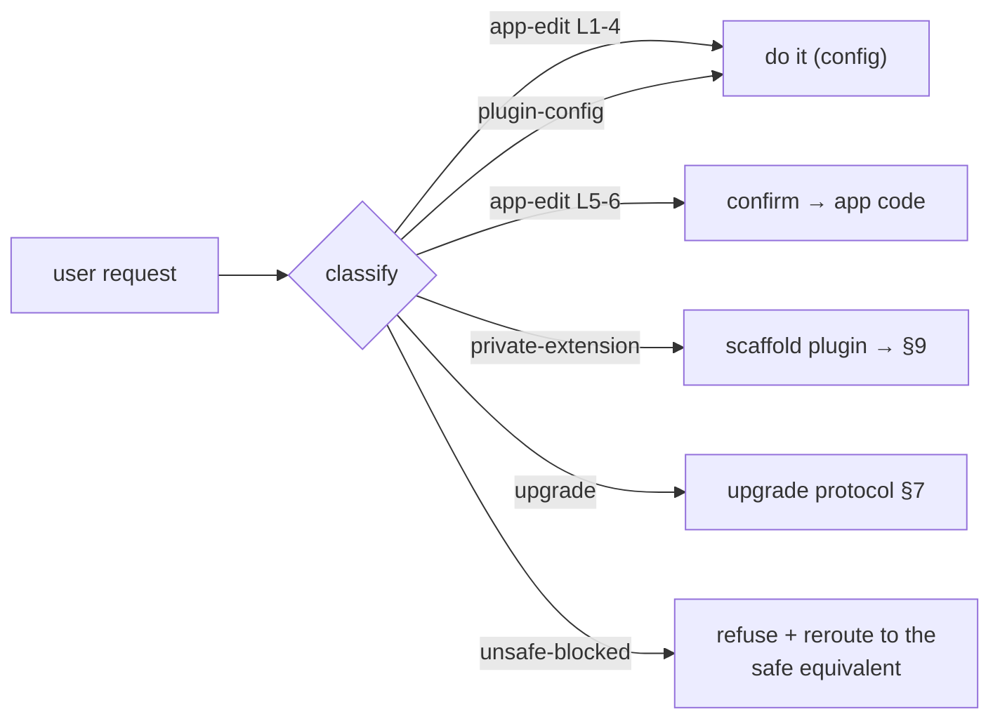

# AI-BUILDER — the builder ⇄ SDK app contract

Status: canonical · **Contract version: 0.2** — changes to this contract require a [DECISIONS.md](DECISIONS.md) entry · Updated: 2026-07-08
Owner-of-truth: this document (the target contract that FAY-1208 / FAY-1212 / FAY-1188 implement) + `@fayz-ai/sdk/ai-builder` (the request taxonomy) + the fayz repo's Panel/manifest machinery

This is the document the fayz platform builds against: how the AI builder installs, configures, customizes, migrates, and operates apps made of this SDK — and what it does when a request exceeds the rails. Everything here obeys the status grammar ruthlessly, because a builder that trusts an unimplemented claim ships a broken app.

---

## 1. Honest baseline

Today the fayz generation pipeline emits generic React apps (localStorage mocks, no `@fayz-ai` usage) — the builder⇄SDK bridge scored **2/10** in the July-2026 audit (FAY-1250). The dogfood apps proving the SDK are hand-written. **This document is the target contract**, not a description of current builder behavior; each section marks what already exists on the SDK side vs what the platform must implement. The convergence lane: FAY-1208 (agent operates the SDK), FAY-1212 (capability discovery), FAY-1188 (scaffold emits the proven conventions).

**CLI baseline moved (2026-07-08):** `fayz create <storefront|admin|member>` scaffolds the proven dogfood shapes — real `@fayz-ai` deps pinned from `release-channels.json`, `fayzVite`, mock providers, derived manifest, a per-kind `CLAUDE.md` checklist — and the output compiles against published npm. The §4 install flow has a working local simulation: the `fayz-create` skill (`.claude/skills/fayz-create`) plays the builder agent end-to-end (proven: Vitalis storefront). The skill's hand-maintained plugin table is interim evidence for the generated capability catalog (Appendix B #7); the platform builder still needs to converge.

## 2. The serialization contract

**The builder writes code; the platform reads a derived manifest.** (ARCHITECTURE §4; DECISIONS 2026-07-01.)

| Artifact | Role | Authored by |
|---|---|---|
| `src/config/app.tsx` | **the source of truth**: `defineSaas(config)` / `createStorefront(config)` — theme, plugins + options, pages, nav | builder SE agent (and devs) |
| `src/plugins.generated.ts` | plugin wiring: package imports + `registerPluginFactory(id, createXPlugin)`; supabase gating (`VITE_USE_SUPABASE`); provider selection (`createSafeXProvider`) | builder, regenerated on plugin changes (course-admin is the reference shape) |
| `src/registry.tsx` | app-owned overrides + `custom:` registrations (ladder 5–6) | builder-with-confirmation / devs |
| `app.manifest.json` → DB `ProjectAppManifest` | **derived, load-bearing**: the Fayz Panel's operating contract | derived — never hand-authored |

### The Panel contract (why the derived manifest matters)

The editor's **Panel tab** renders from the manifest: each surface entry (`admin` / `storefront` / `portal`) declares its `plugins`, `pages`, and `entities`, and the Panel unlocks **installed module tabs** from them — an app with an ecommerce surface gets the commerce operator console (the mini-Shopify); an agenda app gets admin/booking controls. Surface actions default per surface (admin → "Open app", storefront → "Open storefront", portal → "Open portal"). Platform side: `ProjectAppManifest` seed + `ManifestSurfaceSection` (FAY-1178/1200).

**Surface control is plugin-driven:** a plugin's `scaffolds`/scope decides which surface hosts it ([PLUGINS.md](PLUGINS.md) §3) — plugin-shop/commerce targets the `ecommerce`/storefront surface; agenda/crm/financial target the `saas`/admin surface; portal plugins target `portal`. The builder must put each plugin's entry under the right surface in the manifest, or the Panel shows the wrong operator world.

**The sync duty:** after any change to `app.tsx`/`plugins.generated.ts`, the builder regenerates the manifest. Tooling: `fayz extract` exists but still detects the deleted `createSaasApp` shape `[partial — gap register]`; the target is deterministic derivation as part of the builder's write path (FAY-1188). Invariant: **a stale manifest makes the Panel lie** — treat manifest sync like a compile step, not a chore.

## 3. What the builder reads (capability discovery)

Machine-readable surfaces, in priority order:

| Surface | What it answers | Status |
|---|---|---|
| `packages/sdk/src/supported-surface.json` | what an app may depend on | implemented |
| package.json metadata (`[experimental]` label, versions) | what is production-ready | implemented — the builder must never offer an experimental plugin as production |
| `PluginManifest` fields (see the table in [PLUGINS.md](PLUGINS.md) §9): `scope`/`verticalId`/`scaffolds` (selection + surface), `description`/`capabilities` (intent match), `entities`/`registries` (what data exists), `aiTools` (assistant operations), `events` (automation wiring), `declaredFeatures`/`permissions` (role setup), `migrations`/`diagnostics` (provisioning + verification), `settings`/`onboarding` (tenant to-dos) | implemented (the fields exist and are typed) |
| `AI_BUILDER_REQUEST_CLASSES` (`@fayz-ai/sdk/ai-builder`) | the request taxonomy (§6) | implemented |
| This doc set (docs-as-agent-specs) | the rules | this refactor |
| **Generated capability catalog** — a versioned JSON index of all plugins (manifest data half + options schema + maturity), published with each release so the builder discovers capabilities without reading source | `[decision-needed — Appendix B; the FAY-1212 deliverable]` |
| **Per-plugin options JSON Schema** (`options.schema.json`, derived from `createXPlugin` types) | how to fill params without reading source | `[decision-needed — Appendix B]` |

## 4. The install flow (anti-install-error protocol)

Failure-branch rules: a `missing_dependency` is fixed by adding the dependency plugin (it's in the manifest — no guessing); an `incompatible_api_version` means the pinned plugin needs a version change, not a workaround; a doctor-red diagnostic names exactly what's missing (`requires.tables/rpcs/views/env`). **The builder never ships doctor-red** — doctor is the same gate CI and the marketplace use ([TESTING.md](TESTING.md) §5).

## 5. Configuration (filling the params)

- Plugin factories take typed options with working defaults — `createAgendaPlugin()` is valid; options refine (statuses, currency/locale, entity lookups, module flags, event hooks). The reference for "fully configured" is `beauty-saas/src/config/app.tsx`; the reference for "minimal correct" is course-admin.
- Precedence: factory defaults → app config options → tenant settings (settings tabs at runtime). Rule of thumb for the builder: **business identity in config** (currency, statuses, labels — things the prompt implies), **tenant preferences in settings tabs** (things the operator tweaks later), never duplicated in both.
- Config values must be serializable-in-code: components/functions go through the registry (`componentId`) or `src/registry.tsx`, not inline lambdas the extractor can't represent (`fayz extract` flags these).
- Theme: one `SaasTheme` (brand HSL + preset + sidebar mode) — [THEMES.md](THEMES.md); one primary add action per module (quickAdd vs ERP menu — DECISIONS 2026-07-03).

## 6. The customization matrix (request routing)

Every user request is classified into exactly one class (`AI_BUILDER_REQUEST_CLASSES`, `@fayz-ai/sdk/ai-builder`); the class determines which layer it may touch. Crossed with the ladder ([CUSTOMIZATION.md](CUSTOMIZATION.md)):

| Class | Ladder | Builder behavior |
|---|---|---|
| **app-edit** | 1–4 (config/theme/recompose/slots) | ✅ autonomous — config edits, no new code files |
| **app-edit** | 5–6 (registry override, `custom:` pages/blocks) | ⚠️ acts with confirmation — writes app-owned code in `src/registry.tsx` + components; announces what was overridden |
| **plugin-config** | 1 | ✅ autonomous |
| **private-extension** | 7 | 🔶 scaffolds (`fayz create plugin`), wires mock provider, hands off — see §9 |
| **platform-or-plugin-upgrade** | — | 🔶 executes the upgrade protocol (§7) for version bumps; feature gaps → files the SDK gap (§9c) |
| **unsafe-blocked** | — | ⛔ refuses and **reroutes**: "edit the CRM plugin's internals" → offer a private-extension; "call Supabase directly" → the provider/connector path. Blocked set: editing `@fayz-ai/*` code, forking SDK pages, importing provider SDKs in app code, bypassing RLS/tenancy/permissions |

The product rule the taxonomy encodes: **the AI never says "impossible"** — it classifies, then acts, routes, or reroutes; only `unsafe-blocked` refuses, and even that offers the safe path.

## 7. Migrations & upgrades

- **Install-time**: plugin schema arrives exclusively via `manifest.migrations[]` — the runner is `[planned FAY-1205]`; until it lands the builder applies plugin SQL through the app's migration pipeline under the live-DB protocol (inventory first, additive/idempotent only, report before destructive — [DATA-MODEL.md](DATA-MODEL.md) §9).
- **Upgrade-time**: an SDK/plugin version bump is an explicit spec edit + rebuild + migration run, following the fleet lifecycle ([OPERATIONS.md](OPERATIONS.md) §4): rehearsal against a snapshot before live fleets, additive-then-flip migrations only, rollback = repin (code) since schema rolls forward.
- **De-documented verbs**: `fayz migrate` / `fayz upgrade` do **not** exist as CLI commands (old docs claimed them). The near-term mechanism is the FAY-1205 runner + the release train; CLI verbs may return as wrappers `[planned]`.
- The builder **never writes raw DDL** against a tenant backend outside a migration file, and never edits an applied migration (append-only rule).

## 8. Database rules for the builder

1. **Project topology decision** ([DATA-MODEL.md](DATA-MODEL.md) §7): product instance (a shop, a course site) → the shared product project (FayzShop/FayzCourse) with its store/tenant discriminator; a business's SaaS → dedicated Supabase project. Provisioning automation is an open operations item ([OPERATIONS.md](OPERATIONS.md) §3) — today dedicated projects are founder-created; the builder requests, never improvises.
2. **Schema only via manifest migrations** — the metafields principle: plugins/apps declare schema; nothing generated touches DDL directly.
3. **RLS canon is non-negotiable** — every tenant-scoped table, the canonical predicate, no exceptions in generated output ([DATA-MODEL.md](DATA-MODEL.md) §3; the Lovable-CVE differentiator).
4. **Ring discipline**: new entities for an app are Ring 2 extensions or a custom plugin's Ring 1 tables — never additions to `saas_core`.
5. **Mock-first**: apps boot walkable on mocks; Supabase is gated behind env (`VITE_USE_SUPABASE` / provider flags) until the backend is provisioned and doctor-green (the course-admin launch pattern).

## 9. The escalation contract (when the request exceeds the rails)

For a customization outside the dogfood/product scope — "a completely different SaaS layout", "a menu type you don't ship", "integrate with my local provider" — the builder walks this ladder, in order, and produces artifacts at every step (never a bare "no"):

- **(a) Custom components by contract** — if the SDK publishes a contract for that surface: implement app-side under `custom:`, register, reference from config ([CUSTOMIZATION.md](CUSTOMIZATION.md) §3). *Artifact: working code in the app repo.* (Storefront sections: implemented; saas shell slots: `[planned FAY-1248]` — until then shell-level asks go to (c).)
- **(b) Scaffold an incubator plugin** — reusable capability with own entities/behavior: `fayz create plugin`, wire mock provider, leave the graduation checklist. *Artifact: a walkable scaffold + README; handoff to the developer/partner for the business logic.*
- **(c) File the SDK gap** — the ask needs a contract that doesn't exist (new zone, new shell, new engine): the builder files a structured gap (what was asked, which contract is missing, the interim delivered via (a)/(b) if any) to the SDK backlog, and tells the user honestly what's interim vs pending. *Artifact: the gap issue + the interim.*

The no-eject rule holds under pressure: the builder never forks SDK pages or patches packages to satisfy (a)–(c) — that trade is one screen today for every upgrade forever.

### Local plugin → marketplace

When a customer/partner's incubator plugin should become distributable: graduation checklist ([CUSTOMIZATION.md](CUSTOMIZATION.md) §4) → `fayz plugin pack` → submission pipeline ([MARKETPLACE.md](MARKETPLACE.md) §3) `[design — frozen until Phase 4]`. The builder's role today: keep incubator plugins **contract-clean from day one** (the scaffold does this) so the path stays a packaging move.

## 10. The runtime data surface for generated code

**Contract v0.1 position (decided with the founder, 2026-07-06): providers-only.** Generated and app-local code reads/writes data through plugin providers (`createSafeDataProvider`, the archetype provider, entity lookups) and the SDK boundary (`getSupabaseClientOptional` where a provider is missing — flagged by the boundary scan as a seam to close, not a pattern to copy).

**The evaluated alternative (documented, decision deferred — Appendix B):** a Base44-style namespaced runtime client — `fayz.entities.<Entity>.list/create/update`, `fayz.connectors.getConnection(type)`, `fayz.functions.<name>()`, `fayz.agents` — but **typed from plugin schemas** rather than Base44's `any`-typed Proxy ([BENCHMARKS.md](BENCHMARKS.md) §4). Trade-offs, honestly: it would give AI-generated bespoke code (level 6–7) a uniform, discoverable API and permission modes (anon/user/service-role) — and it is a new engineering commitment that duplicates part of the provider layer and expands the surface to version. Revisit when level-6+ generated code is common enough that provider wiring is the builder's measured bottleneck — not before (second-real-consumer rule).

## 11. Contract changelog & open items

| Version | Date | Changes |
|---|---|---|
| 0.1 | 2026-07-06 | Initial contract: serialization + Panel sync duty, capability discovery surfaces, install protocol, request-routing matrix, migration/DB rules, escalation contract, providers-only runtime surface |
| 0.2 | 2026-07-08 | CLI scaffolds real apps (dogfood shapes, release-channel pinned deps); `fayz-create` skill = local agent simulation of §4; `sync-release-channels.mjs` keeps pins honest; `@fayz-ai/portal` promoted to supported surface |

Open `[decision-needed]` items affecting this contract (all queued in [ROADMAP.md](ROADMAP.md) Appendix B): generated capability catalog + options schemas (§3); typed runtime client (§10); componentId validator fix (blocks registry-indirect routes); auto_install field shape (affects plugin selection); `fayz extract` replacement (§2).
