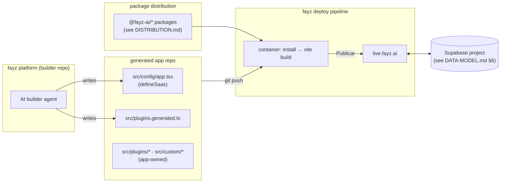
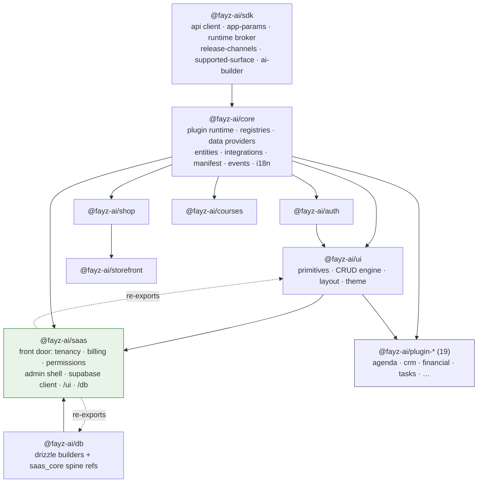
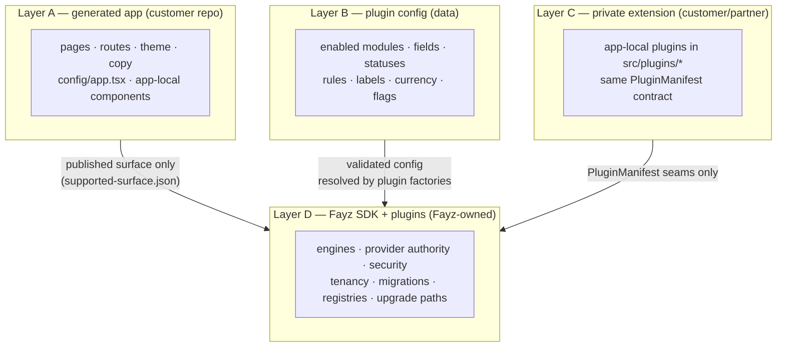
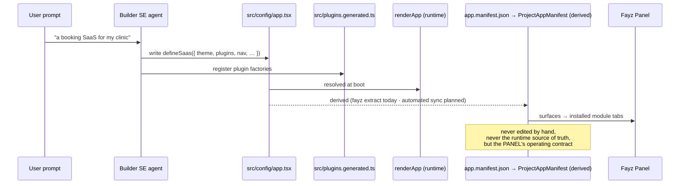
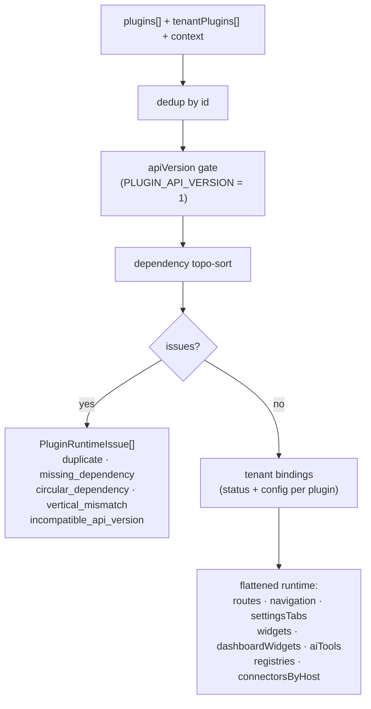
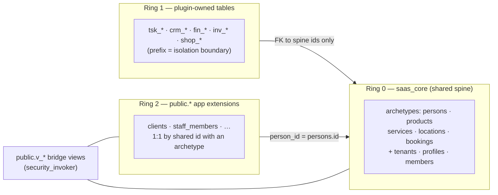

# ARCHITECTURE — what fayz-sdk is and the rules that hold it together

Status: canonical · Updated: 2026-07-06
Owner-of-truth: FAY-1217 (boundary contract, Done) + FAY-1250 (foundation phases) + `packages/*` as-built

This is the north star. It absorbs and supersedes `architecture-boundaries.md` (the FAY-1217 ownership contract, still authoritative in its new home) and `architecture-v2.md` (whose manifest-first framing was reversed — see §5). Domain detail lives in the sibling docs; this document is the map and the invariants.

---

## 1. What fayz-sdk is

Fayz's promise is **"one prompt → a working business"** — not AI-generated code, but a working e-commerce or SaaS with real auth, real data, real payments, on rails. The SDK is the mechanism: a set of versioned packages that every Fayz app depends on, carrying the common implementations (API access, auth, tenancy, data providers, UI system, logging seams) and a **plugin architecture** through which all product capability ships.

The bet, stated once: generated apps that *compose audited engines* stay secure, upgradeable, and maintainable; generated apps made of bespoke generated code do not ([BENCHMARKS.md](BENCHMARKS.md) §3 — the Lovable CVE and the regeneration-is-not-an-upgrade-path lesson). Product on rails, not AI slop.

**The deploy model is part of the architecture** (DECISIONS 2026-07-02): every app is a fayz project — push → container installs `@fayz-ai/*` from the registry → `vite build` → founder clicks Publicar. SDK changes reach production **only** via publish + version bump. No local-source paths in app builds, no parallel hosts (Vercel/Netlify) — the fayz pipeline is itself the product being validated.

### Three-repo topology

| Repo | Role |
|---|---|
| `fayz-sdk` (this repo) | The engines: packages, plugins, CLI, contracts, these docs |
| `fayz-app/*` | Dogfood apps (beauty-saas, course-admin/members, shops, agency-os, norman-ai, resto-saas) — standalone Vite apps consuming published packages; the proving ground |
| `fayz` | The platform: AI builder, editor, deploy pipeline, Fayz Panel. Operates apps through the contract in [AI-BUILDER.md](AI-BUILDER.md) |

---

## 2. Package topology

- `@fayz-ai/sdk` is the root of the graph (no internal deps): API client, app params, runtime broker, release channels, `supported-surface.json`, the AI-builder request taxonomy.
- `@fayz-ai/core` is the contract layer: `PluginManifest` + runtime, the override registries, data providers, the connector spine, the app-manifest schema.
- `@fayz-ai/saas` is the app front door for SaaS apps — it re-exports `@fayz-ai/ui` at `/ui` and `@fayz-ai/db` at `/db` (deliberate subpath split so drizzle-kit and dep optimizers stay clean) and the core types apps need.
- **Decision (FAY-1217):** the public surface is **multi-package** — the packages above, enumerated machine-readably in `packages/sdk/src/supported-surface.json`, which `fayz doctor` checks app dependencies against. We did not build a separate `@fayz/plugin-sdk` (FAY-926 canceled) and we do not add packages to satisfy customizations.
- `@fayz-ai/app-runtime` (umbrella re-export) is deprecated, `private: true`, and will be removed `[planned — gap register]`.
- Who may install what — public substrate vs commercial plugins — is a **distribution** concern, first-class in [DISTRIBUTION.md](DISTRIBUTION.md). Short form: the contracts community code compiles against stay public; the product plugins move behind a restricted registry.

---

## 3. The four ownership layers (FAY-1217, locked)

The promise: *a user starts from a ready-made vertical product, customizes most of it instantly with AI, extends deeper business behavior through safe modules, and still keeps the app upgradeable as Fayz improves the platform.* The mechanism is a strict ownership boundary — four layers, each with a different owner, change cadence, and blast radius:

| Layer | Owner | Changed by | Upgrade-safe because |
|---|---|---|---|
| **A. Generated app** | customer's repo | AI builder (config) + app devs | never imports SDK internals; depends only on the supported surface |
| **B. Plugin config** | the config (data) | AI builder, live | validated options resolved by plugin factories; manifest-version migrations |
| **C. Private extension** | customer/partner | partner devs | extends via the same `PluginManifest` contract; never edits shared internals; promotable to D |
| **D. SDK + plugins** | Fayz | Fayz only | versioned packages; `apiVersion`-gated contracts; internals de-bridge freely behind them |

**The load-bearing rule:** A, B, C depend on D only through the published contract — the package surface, the registries, the `PluginManifest` seams, and the data-provider boundary. Nobody forks an SDK page, copies plugin internals, or reaches a provider SDK directly. There is **no eject path by design**: if a customer must eject, that's an SDK gap to file, not a workflow to support.

### The provider-access rule

> **App talks to Fayz; Fayz talks to providers.**

Apps and plugins never import provider SDKs (`@supabase/supabase-js`, `stripe`, `mercadopago`, `googleapis`, Bling, Tecnospeed…). Backend access goes through Fayz-owned boundaries: `getSupabaseClientOptional()` / the `DataProvider` interface (`packages/core/src/data/supabase.ts`), and the connector spine ([CONNECTORS.md](CONNECTORS.md)) whose data plane (Supabase Edge Functions) holds credentials server-side. One sanctioned exception: a layer-C plugin may own a connector + Edge Function for a provider Fayz doesn't support yet (beauty-saas's Tecnospeed PlugBank is the precedent) — declared, server-side-credentialed, and a promotion candidate. `cli/src/lib/boundaries.ts` maintains the blocklist; `fayz doctor` warns on violations.

### Enforcement is soft — by decision

Enforcement (FAY-1217) is visibility, not build failures: `fayz doctor` warns on provider-SDK imports, off-surface dependencies, contract violations, missing RPCs/views, pending migrations, locale gaps. Hard CI gates exist only where the capability ratchet has locked a plugin (`scripts/check-plugin-capability.mjs --strict` — see [PLUGINS.md](PLUGINS.md) §5). Revisit if drift proves costly.

---

## 4. The serialization boundary: codegen, not JSON

**Decision (2026-07-01, reverses the architecture-v2 framing):** the boundary between the AI builder and an app is **code generation**. The builder's software-engineer agent writes `src/config/app.tsx` — `defineSaas(config)` for SaaS, `createStorefront(config)` for shops. The config file *is* the serialization format; an LLM is the serializer. `ProjectAppManifest` / `app.manifest.json` is a **derived index** (for the platform's catalog/panel), never the source of truth. This kills the "configs contain functions and components, so we can't serialize" blocker — functions and components are exactly what code can express and JSON cannot.

**Derived does not mean unimportant.** `app.manifest.json` (synced to the DB-backed `ProjectAppManifest` — FAY-1178/1200) is the contract the **Fayz Panel** operates from: each surface entry (`admin`, `storefront`, `portal`) lists its `plugins`, `pages`, and `entities`, and the Panel unlocks **installed module tabs** accordingly — an app with an ecommerce surface gets the commerce operator console (the "mini-Shopify"), an agenda app gets its admin controls. Surfaces are the operator-control axis: a plugin's `scaffolds`/surface targeting decides *which Panel world it opens* ([PLUGINS.md](PLUGINS.md) §3, [AI-BUILDER.md](AI-BUILDER.md) §2). Two consequences: the derivation pipeline (`fayz extract` today `[partial]` — it still detects the deleted `createSaasApp` shape; automated sync is the FAY-1188 lane) is load-bearing infrastructure, and **a stale manifest makes the Panel lie** — keeping app.tsx → manifest in sync is part of the builder contract.

Other consequences: the AI builder's edit target is TypeScript (with the request taxonomy deciding *what* it may touch — [AI-BUILDER.md](AI-BUILDER.md) §6); config validation is the type system plus `fayz doctor`; and every dogfood app is living proof of the format (`beauty-saas/src/config/app.tsx` is the richest example).

---

## 5. The plugin runtime in one page

Everything product-shaped ships as a plugin declaring a `PluginManifest` — the full contract is [PLUGINS.md](PLUGINS.md). At boot, `resolvePluginRuntime` (`packages/core/src/plugin/runtime.ts`) turns declared plugins + tenant bindings into the running app:

Composition rules that keep 19+ plugins from becoming WordPress ([BENCHMARKS.md](BENCHMARKS.md) §1.2): every extension point is a **typed manifest field**, not a callback into a global namespace; UI injection happens only in the **closed `WidgetZone` enum**; component overrides go through the **registry** (last-registration-wins, `custom:` namespace reserved for app code); shared-surface UI is **opt-in or surface-scoped, never broadcast** (DECISIONS 2026-07-02, the FAY-1247 lesson); and cross-plugin data crosses **no foreign keys** ([DATA-MODEL.md](DATA-MODEL.md) §4).

---

## 6. The data architecture in one page

Three rings, fully specified in [DATA-MODEL.md](DATA-MODEL.md):

Every tenant-scoped table carries the canonical RLS predicate; plugins ship their schema as migrations in their manifest; apps get a Supabase project per the topology standard (shared product projects vs dedicated per SaaS). The Shopify analogy holds: **plugins declare schema, they don't touch the database** ([BENCHMARKS.md](BENCHMARKS.md) §2.5).

---

## 7. Guardrails philosophy

From Shopify ([BENCHMARKS.md](BENCHMARKS.md) §2.6): **guardrail the money paths, free the rest.**

- **Constrained surfaces** — payments/checkout, auth, tenancy/RLS, provider credentials: implemented in SDK engines and edge functions, never in generated or app-local code; changes here are SDK work with review, whatever the prompt says.
- **Free surfaces** — UI composition, themes, copy, workflows, custom entities, reports: the customization ladder ([CUSTOMIZATION.md](CUSTOMIZATION.md)) gives apps and the AI builder progressive freedom with zero blast radius into the constrained zone.

When community plugins arrive, untrusted business logic follows the Shopify Functions shape — declared data in, declarative operations out, host executes `[planned — MARKETPLACE.md]`.

---

## 8. Distribution in one paragraph

The package registry is an architectural boundary, not an ops detail: **protocol public, products private.** The substrate that app code and community plugins compile against (`sdk`, `core`, `db`, `auth`, `ui`) stays publicly installable; the commercial domain plugins and vertical templates are distributed through a restricted registry, with the marketplace as the eventual distribution channel for third-party plugins. Current state, remediation, and the release-train mechanics: [DISTRIBUTION.md](DISTRIBUTION.md).

---

## 9. Anti-patterns we refuse

Each is a documented ecosystem failure ([BENCHMARKS.md](BENCHMARKS.md)); each has a fayz mechanism that forecloses it:

| We refuse | Because (evidence) | Foreclosed by |
|---|---|---|
| Untyped extension points / bare callbacks | WP hooks → conflict hell, §1.2 | typed `PluginManifest` seams only |
| Plugins with ambient full privileges | WP: >90% of vulns are plugins, §1.1 | manifest-declared capabilities/permissions; provider rule; RLS in the schema contract |
| Global namespace, load-order behavior | WP `function_exists` roulette, §1.2 | namespaced ids, registries, closed zones |
| Forking/ejecting to customize | Odoo upgrade breakage, §3 | the ladder + no-eject rule (§3 above) |
| Breaking the extension contract silently | Gutenberg, §1.3 | `apiVersion` gate now; calendar versioning `[planned]` (PLUGINS.md §6) |
| One-time review, unmaintained listings | WP directory decay, §1.1 | continuous re-scan + abandonment policy in the marketplace design |
| Bespoke generated security code | Lovable CVE, §3 | apps compose audited engines; money paths constrained (§7) |
| Registry/governance as personal fiefdom | WP Engine crisis, §1.4 | written marketplace rules + exit path (MARKETPLACE.md, OPERATIONS.md §export) |

---

## 10. Invariants

The short list every change is checked against:

1. **The one architectural rule:** plugin shared-surface UI is opt-in or surface-scoped, never broadcast. Cross-consumer verification (beauty AND norman) for any shared-plugin UI change.
2. **Second-real-consumer rule:** abstractions are built pull-only — no speculative platform surface (DECISIONS 2026-07-02, platform freeze).
3. **Advertised surface = real surface:** skeleton plugins carry `[experimental]` in package.json + README; an AI builder reads package metadata and must not be lied to.
4. **App talks to Fayz; Fayz talks to providers** (§3).
5. **Codegen is the serialization boundary; derived manifests are never authored** (§4).
6. **Plugins declare schema via manifest migrations; nothing else touches DDL** ([DATA-MODEL.md](DATA-MODEL.md) §5).
7. **No eject path.** A needed eject is an SDK gap to file.
8. **Green = typecheck + build + dev-smoke** — type-green alone has shipped broken dev servers (DECISIONS standing rules).
