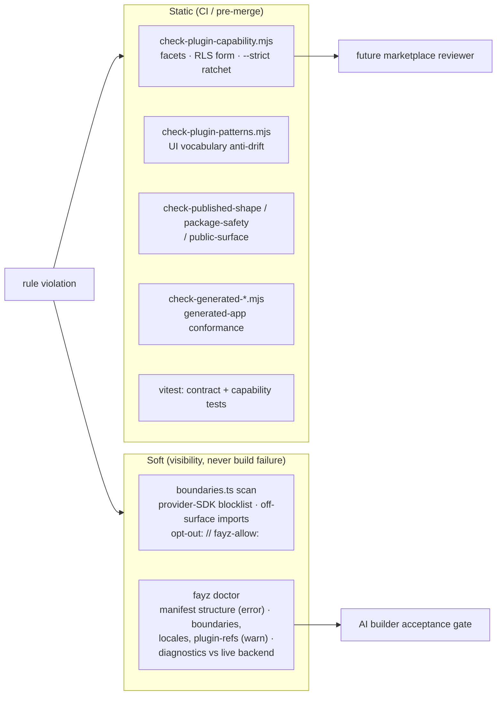

# BEST-PRACTICES — the twelve rules and the enforcement map

Status: canonical · Updated: 2026-07-06
Owner-of-truth: [BENCHMARKS.md](BENCHMARKS.md) §5 (the rules' evidence) + the check scripts (their enforcement)

The twelve transferable rules distilled from ecosystem history, each mapped to where fayz enforces it today. Security-specific practice lives in [SECURITY.md](SECURITY.md); operational standing rules live in [DECISIONS.md](DECISIONS.md) (this doc indexes, never restates).

---

## 1. The twelve rules, operationalized

| # | Rule | Enforced by (today) | Status |
|---|---|---|---|
| 1 | **Typed manifest or it doesn't exist** — every extension point is a declared, versioned contract | `PluginManifest` types; `assertPluginManifestContract`; `check-manifest-contract.mjs` | implemented |
| 2 | **Plugins declare schema, never touch the DB** — migrations in the manifest, RLS canon | M-LOCK: `check-plugin-capability.mjs --strict` (RLS form) | implemented (form) / `[partial]` (4 plugins ship loose SQL — [DATA-MODEL.md](DATA-MODEL.md) §5) |
| 3 | **Untrusted logic = declared data in, declarative ops out** | n/a — no third-party code runs yet | `[design — MARKETPLACE.md]` |
| 4 | **Capability permissions in the manifest** — `permissions` + `declaredFeatures`, gated at runtime | `PermissionGate`/`usePermission`; deny-by-default in multi-tenant | implemented |
| 5 | **Real isolation boundaries, not conventions** | first-party is in-process by design; community code gets a real boundary | `[design — Phase 4]` |
| 6 | **Calendar-versioned plugin API with overlap windows** | `apiVersion` gate (floor) | `[planned — PLUGINS.md §6, decision queue]` |
| 7 | **Review at listing AND forever** — re-scan, abandonment policy, kill switch | capability gate exists (the future machine reviewer) | `[design — MARKETPLACE.md §3]` |
| 8 | **Quality tiers tied to distribution** | `[experimental]` labels (the inverse tier: honesty about skeletons) | implemented (labels) / `[design]` (tiers) |
| 9 | **Test the composition, not just the plugin** | cross-consumer verification rule (manual); golden configs | `[partial — TESTING.md §4]` |
| 10 | **Guardrail the money paths, free the rest** | boundaries blocklist (provider SDKs); payments only in SDK engines | implemented (boundary) — [SECURITY.md](SECURITY.md) §6 |
| 11 | **Design system as contract** | `check-plugin-patterns.mjs` (raw-table, settings-gear, local-dedup rules) | implemented — [THEMES.md](THEMES.md) §3 |
| 12 | **Governance and exit are architecture** | written docs + export/eject story | `[design — MARKETPLACE.md, OPERATIONS.md §6]` |

## 2. The enforcement map

The deliberate asymmetry (FAY-1217): boundary rules are **soft** (warnings — partner DX over purity), while the capability ratchet and pattern gates are **hard** where locked. Escape hatches are always explicit and greppable: `// fayz-allow: <reason>` for boundaries, `drift-allow: <rule>` for patterns — an audit trail, not a loophole.

## 3. Authoring conventions (the short list)

- **Naming**: plugins `plugin-<name>`, table prefixes 3–4 chars (`tsk_`, `crm_`), registry ids namespaced by plugin (`agenda.week-view`), app-local ids `custom:` — never generated by the platform.
- **Ids are contracts**: renaming a registry id, route path, widget zone, or event name is a breaking change; treat like an API removal (deprecation first).
- **i18n**: pt-BR + en for every plugin string; locales in the manifest.
- **Providers**: `createSafeDataProvider` (supabase-or-mock) is the standard seam; every plugin must be demo-walkable with `mockData`.
- **Imports**: substrate through the published surface; `@fayz-ai/db` for schema (never `drizzle-orm/pg-core` direct); no deep imports into `src/`.
- **One primary add action per module**; shared-surface UI opt-in or surface-scoped (DECISIONS 2026-07-03 / 2026-07-02).
- **Versioning discipline**: changesets on every publishable change; `[experimental]` label until the capability bar; exact pins in apps ([DISTRIBUTION.md](DISTRIBUTION.md) §4).

## 4. Operational rules (index — DECISIONS.md is the source)

Parallel-lane staging (surgical `git add`, never `-A`) · the green definition (typecheck + build + dev-smoke) · live-DB protocol (inventory first, report-before-destructive, skip-ledger) · founder communication (pt-BR coordination, English code/Linear) · deploy only via the fayz pipeline (no side-channel hosts).
