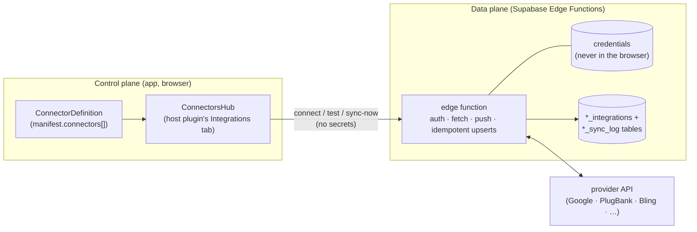
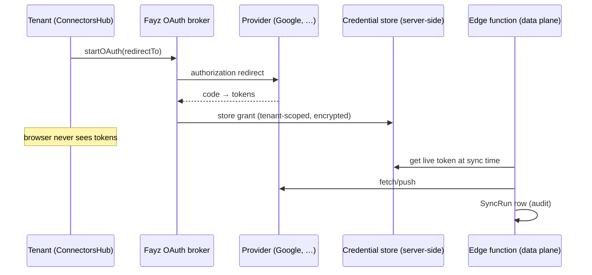

# CONNECTORS — the integration spine and the connector standard

Status: canonical · Updated: 2026-07-06
Owner-of-truth: `packages/core/src/integrations/index.ts` (the contract) + `plugins/plugin-agenda/src/integrations/google-calendar/` (the reference)

Integrations are **endless** — every vertical wants its calendar, bank, ERP, messenger, fiscal authority. The platform survives that only if the Nth connector is boring: same anatomy, same credential handling, same audit trail, same review path. This document is that standard.

---

## 1. The spine: control plane / data plane

**The provider rule frames everything: app talks to Fayz, Fayz talks to providers** ([ARCHITECTURE.md](ARCHITECTURE.md) §3). A connector is split accordingly:



- **Control plane** — what the tenant sees and configures: `ConnectorDefinition` on `manifest.connectors[]`, rendered by `ConnectorsHub` inside the **host plugin's** settings as a unified Integrations tab. The runtime groups connectors by `hostPluginId` (`connectorsByHost`); `useConnectorsForPlugin(hostPluginId)` is the hook.
- **Data plane** — an Edge Function that owns the provider credential, performs auth/fetch/push with idempotent upserts, and records every run.

Contract types (`@fayz-ai/core/integrations`):

| Type | Role | Key fields |
|---|---|---|
| `ConnectorDefinition` | UI-facing, on the manifest | `id`, `hostPluginId` (the plugin it extends), `name`, `authKind` (`oauth`/`api-key`/`mtls`), `fields[]` (config form), `getStatus()`, `testConnection?`, `saveConnection?`, `startOAuth?(redirectTo)`, `disconnect?`, `ExtraPanel?` (custom React panel) |
| `Connector` | data-plane descriptor | `id`, `provider`, `pluginId`, `authKind`, `capabilities[]` (`{entity, direction, triggers}`), `testConnection?`, `sync?` |
| `ConnectionConfig` | a `*_integrations` row | `provider`, `active`, `settings?` (**never secrets**), `lastSyncAt?` |
| `SyncRun` | the audit unit | `provider`, `direction` (`inbound`/`outbound`/`bidirectional`), `trigger` (`on-write`/`scheduled`/`manual`/`webhook`), `status` (`success`/`partial`/`error`), `fetched?`, `written?`, `cursor?`, `error?` |

Outbound sync without an event bus: `withAfterHooks(provider, handlers)` — a Proxy that fires fire-and-forget handlers after provider writes resolve; handler failures never break the app call.

## 2. Connector anatomy (the folder standard)

One folder per connector, fixed shape — adapted from Cal.com's app-store ([BENCHMARKS.md](BENCHMARKS.md) §4):

```
<plugin>/src/integrations/<provider>/
  connectorDef.tsx     ConnectorDefinition (control plane: status, fields, panel)
  connector.ts         data-plane descriptor + client helpers
  mapping.ts           provider model ↔ fayz model, pure functions (unit-testable)
  data/supabase.ts     *_integrations / *_sync_log access
  migrations/          NNN_<provider>.sql — integration + sync-log tables, RLS canon
  integration.test.ts  contract + mapping tests
```

An **addon plugin** (a connector that ships separately from its host — the openbanking pattern) wraps the same folder in a plugin: `scope: 'addon'`, `dependencies: ['<host>']`, `connectors: [def]`, no navigation of its own.

Declared availability follows the Cal.com rule: a connector's status derives from whether its **per-tenant credential exists and is valid** — install-state lives in the DB, not in env vars.

## 3. Credentials

**Position:** two pieces, adopted from the two best references —

1. **Generic credential record** (Cal.com shape): one table pattern for all connectors — `{ provider/type, key (encrypted), tenant scope, invalid flag }` — rather than per-connector credential tables. Today each connector ships its own `*_integrations` table `[partial]`; converging on the shared record is gap-registered.
2. **Platform-brokered tokens** (Base44 shape): app code never executes an OAuth dance or holds a refresh token. The runtime broker (`packages/core/src/runtime/oauth.ts`, `createFayzRuntimeClient`) exchanges and stores grants; edge functions pull live tokens server-side.



`[decision-needed]` — broker deployment location (fayz platform service vs per-app edge function); queued in Appendix B. Either way the invariant holds: **secrets exist only server-side; `ConnectionConfig.settings` never carries them.**

## 4. Reference implementations

- **Google Calendar** (in-tree, the canonical walkthrough) — `plugins/plugin-agenda/src/integrations/google-calendar/`: `googleCalendarConnectorDef` (`hostPluginId: 'agenda'`, `authKind: 'oauth'`, ExtraPanel with calendar picker + sync-now + run history); outbound via a trigger on `saas_core.bookings` → `pg_net` → the `google-calendar-sync` edge function; inbound via `pg_cron` + Google watch webhooks; the provider link stored on `bookings.metadata.googleCalendarEventId`; `calendar_integrations` + `calendar_sync_log` tables from its own migration.
- **Open banking / Tecnospeed PlugBank** (app-side incubator, the addon case study) — `beauty-saas/src/plugins/openbanking`: an addon plugin contributing a connector into plugin-financial, own Edge Function, documented graduation path to `plugin-banking-br`. Proof that layer C can ship a real connector without SDK changes ([CUSTOMIZATION.md](CUSTOMIZATION.md) §4).
- **Bling ERP** (design brief) — `design/bling-integration-brief.md`: the commerce connector plan (entity mapping, sync mechanics, responsibility split) for the Pix-commerce wave.

## 5. The first-party connector portfolio (~20)

The taxonomy the products need, with honest status — this table is the connector half of the plugin census:

| Category | Connectors | Host | Status |
|---|---|---|---|
| Calendar | Google Calendar | agenda | ✅ implemented |
| Open banking | PlugBank (→ `plugin-banking-br`) | financial | incubator (beauty-saas) |
| Payments | MercadoPago + Pix | shop/financial | `[planned]` — Wave 2 gate |
| Fiscal | NFSe / NF-e (`plugin-fiscal-br`) | financial | `[planned FAY-1220 map]` |
| ERP | Bling | shop/inventory | `[planned]` — design brief exists |
| Messaging | WhatsApp | crm/agenda | `[planned]` |
| Email | transactional provider | marketing | `[planned]` |
| Accounting | (per-country) | financial | `[planned]` |

Rule for growing this list: a connector ships **only** with a paying use case attached (second-real-consumer rule applies to integrations too); everything else stays a folder-shaped design brief.

## 6. Community connectors

A community connector is an addon plugin and goes through the identical submission pipeline as any community plugin — same artifact, same automated review, same signing, plus the connector-specific checks (no secrets client-side, SyncRun audit wired, idempotent upserts, mapping tests). See [MARKETPLACE.md](MARKETPLACE.md) §3 `[design — frozen]`. The deliberate-adapter exception ([ARCHITECTURE.md](ARCHITECTURE.md) §3) is the incubation path: partners ship the connector app-locally first, exactly like openbanking.
