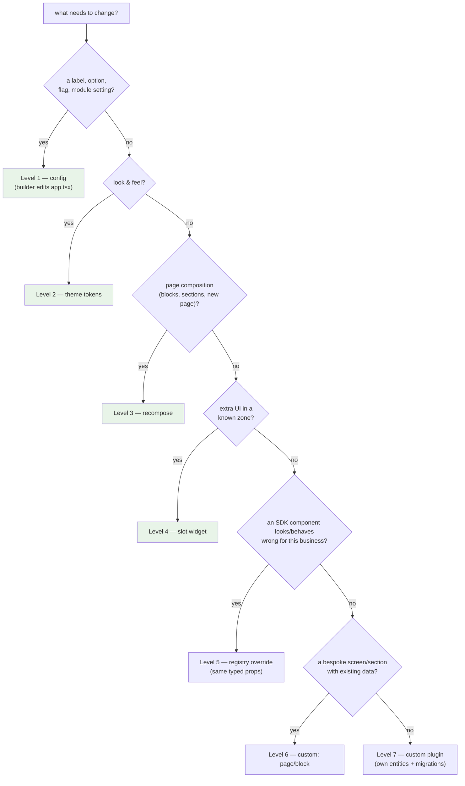
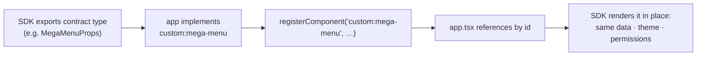

# CUSTOMIZATION — the ladder, component contracts, and incubator plugins

Status: canonical · Updated: 2026-07-06
Owner-of-truth: `packages/core/src/registry` (overrides) + `packages/core/src/types/plugins.ts` (seams) + FAY-1217 layer model

The product rule: **defaults everywhere, dead-ends nowhere, no eject path.** A Fayz app goes from pure config to fully bespoke without ever forking SDK code; every level is strictly additive, so a client at level 6 still receives SDK upgrades for everything they didn't touch. If a customer would need to eject, that is an SDK gap to file — not a workflow to support.

This document absorbs `customization-ladder.md` and `private-plugins.md`, reframed for the codegen serialization boundary (DECISIONS 2026-07-01): the artifact being edited is **`src/config/app.tsx`** (`defineSaas`), not `app.manifest.json` — the manifest is derived ([ARCHITECTURE.md](ARCHITECTURE.md) §4).

---

## 1. The ladder

| Level | What changes | Where | Code? | Who typically drives |
|---|---|---|---|---|
| 1 **Config** | labels, currency, flags, plugin options | `defineSaas` config | no | AI builder, autonomously |
| 2 **Theme** | preset + token overrides | `defineSaas` `theme` | no | AI builder, autonomously |
| 3 **Recompose** | reorder/add/remove blocks, new pages | config `pages`/blocks | no | AI builder, autonomously |
| 4 **Slots** | inject widgets into named zones | manifest widget refs | sometimes | AI builder, autonomously |
| 5 **Override** | replace an SDK component/block by registry id | `src/registry.tsx` | yes | builder with confirmation / dev |
| 6 **Custom pages/blocks** | bespoke React under `custom:` ids | `src/registry.tsx` + components | yes | builder with confirmation / dev |
| 7 **Custom plugin** | own entities, migrations, nav, AI tools | `src/plugins/<name>/` | yes | dev/partner (builder scaffolds) |



Shaded levels (1–4) are **builder-autonomous** — config-only, no new code files. Levels 5–6 produce app code confined to `src/registry.tsx` + the app's own components; level 7 produces an app-local plugin. The full autonomy/confirmation/escalation matrix for the AI builder is [AI-BUILDER.md](AI-BUILDER.md) §6.

## 2. The contracts behind each level

- **Config (1)** — plugin factory options (`createAgendaPlugin({ statuses, currency, … })`), typed, resolved by the factory. The richest live example is `beauty-saas/src/config/app.tsx`.
- **Theme (2)** — token overrides on a preset; the `__kind: 'saas-theme'` discriminated shape ([THEMES.md](THEMES.md)).
- **Recompose (3)** — pages are block trees resolved through the block registry; `listBlocks()` enumerates what's available; blocks carry props schemas so a picker/agent can compose them as data.
- **Slots (4)** — the **closed** `WidgetZone` enum (`shell.sidebar.*`, `shell.topbar.*`, `page.before/after`, `settings.*`, `shell.floating`) with declarative visibility. Zones are added by the SDK, never by apps — that's what keeps them composable ([PLUGINS.md](PLUGINS.md) §3).
- **Override (5)** — every SDK component that renders a domain concept has a registry id (`crud.detail-header`, `agenda.week-view`, block `hero`…). Re-registering the id in `src/registry.tsx` wins (**last-registration-wins**); the override receives the **same typed props** as the original, so SDK internals keep evolving behind the contract:

  ```tsx
  // src/registry.tsx
  import { registerComponent, registerBlock } from '@fayz-ai/saas'
  registerComponent('crud.detail-header', BrandedDetailHeader)
  registerBlock('hero', FancyHero)
  ```

- **Custom (6)** — bespoke React under the reserved **`custom:` namespace** (`isCustomId` guards it; the platform never generates `custom:` ids — they can only come from the app repo). Registered components run with full SDK context (provider, tenant, permissions, i18n) via hooks and are referenced from config by id.
- **Plugin (7)** — the same `PluginManifest` contract as official plugins (§4).

The registry is introspectable (`listBlocks`, `listComponents`, …) — the platform always knows exactly what an app overrides, which is how `fayz doctor` reports customization drift.

`[partial]` — the `componentId` indirection is accepted by every manifest surface but `assertPluginManifestContract` still rejects componentId-only routes (gap register). Until fixed, route-level overrides need the component form.

## 3. Custom components by contract (the "different menu in India" case)

The pattern for *"I need a kind of X you don't ship"*: the SDK exports the **prop contract**, the app supplies the implementation, the builder wires it in config. The storefront proves it today with section **component contracts** (`@fayz-ai/storefront` `component-contracts/define.*`): a shop passes its own `MenuSection` component satisfying the published props type, and the SDK renders it inside its own layout, data flow, and theme — the customization is bespoke, the integration is contractual.



State: `[implemented]` for storefront sections; the saas shell's equivalent (named layout/menu slots with published contracts) is `[planned FAY-1248/FAY-1196]` — the persona/slots phase. When a requested customization has no contract yet, that's the escalation path in [AI-BUILDER.md](AI-BUILDER.md) §9: the request becomes an SDK contract to add, and the interim answer is level 6/7.

## 4. Incubator plugins (layer C — app-local, contract-identical)

When a customization is a **reusable capability** — its own entities, data, migrations, navigation, AI tools — it's a plugin. An incubator plugin lives in the app repo (`src/plugins/<name>/`) and implements the *identical* contract as official plugins. The safety rule: **there is nothing an SDK plugin can do that a client plugin can't** — a partner is never blocked, and promotion is a packaging move, not a rewrite.

```bash
fayz create plugin loyalty
```

scaffolds the full shape: `index.ts` (factory → `PluginManifest`), `data/{types,mock,supabase}.ts` (provider seam, mock-first), `schema/` (migrations wired into the manifest), `README.md` (graduation checklist).

Two proven styles, both shipping today:

| Style | Reference | Mechanism |
|---|---|---|
| **Addon / connector** | `beauty-saas/src/plugins/openbanking` (Tecnospeed PlugBank) | `scope: 'addon'`, `dependencies: ['financial']`, contributes a `ConnectorDefinition` into the host's Integrations tab + its own Edge Function; credentials server-side (the sanctioned adapter exception) |
| **Provider injection** | `resto-saas` restaurant/menu | owns schema + migrations + a real Supabase provider, injects it into the SDK plugin's `dataProvider` seam — SDK UI, app data, no duplication |

Rules that keep upgrades safe: extend only through manifest seams; go through the Fayz provider boundary (never `@supabase/supabase-js` direct — [ARCHITECTURE.md](ARCHITECTURE.md) §3); run `fayz doctor`. And the Odoo lesson ([BENCHMARKS.md](BENCHMARKS.md) §3): extensions are **attributable** — everything a plugin contributes is declared under its id in its manifest. There is no mechanism to monkey-patch another plugin, by design.

### Graduation: incubator → official

- [ ] `assertPluginManifestContract` passes (`@fayz-ai/core/testing`)
- [ ] capability test proves the data slice end-to-end on the mock provider
- [ ] migrations wired into `manifest.migrations[]` (not just files in `schema/`)
- [ ] permissions declared (deny-by-default in multi-tenant)
- [ ] i18n complete (pt-BR + en)
- [ ] `fayz doctor` clean
- [ ] move the folder to `fayz-sdk/plugins/plugin-<name>/src/` — manifest and behavior unchanged

The same checklist is the first half of the **community submission pipeline** ([MARKETPLACE.md](MARKETPLACE.md) §3): a third-party developer's path from "customization in my app" to "listed plugin" starts exactly here.

## 5. When the ladder tops out

A request that doesn't fit any level — a fundamentally different app shell, a new surface — is not a customization; it's an SDK gap. The routing (options, artifacts, who decides) is the escalation contract in [AI-BUILDER.md](AI-BUILDER.md) §9. What never happens: forking an SDK page or patching `node_modules` — that trades one screen today for every upgrade forever ([BENCHMARKS.md](BENCHMARKS.md) §3, the Odoo upgrade tax).

## 6. Why upgrades stay safe (the moat)

- Overrides are keyed by id and receive the original's typed props → SDK internals change freely behind them.
- Custom code is confined to `src/registry.tsx`, the app's components, and app-local plugins — never copies of SDK pages — so an SDK version bump + migration run touches everything the app *didn't* customize and leaves overrides intact.
- The registry + manifest are introspectable, so the platform knows per-app exactly what's customized — which is what makes fleet upgrades tractable ([OPERATIONS.md](OPERATIONS.md) §4) and what WordPress never had.
