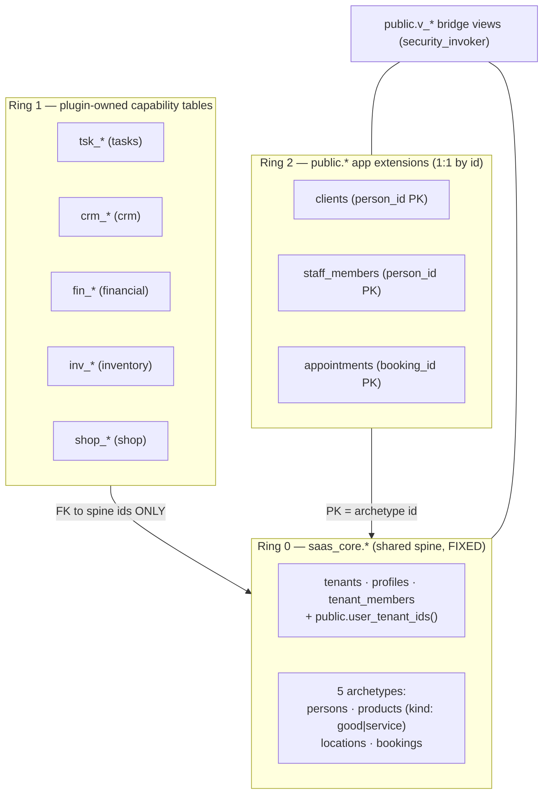
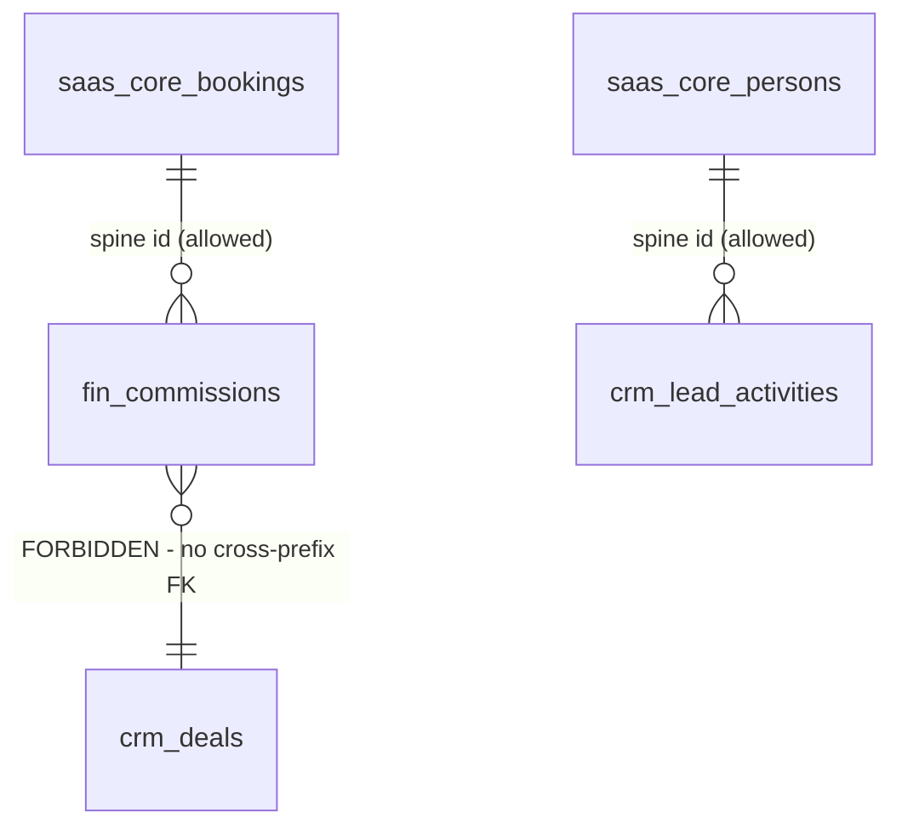
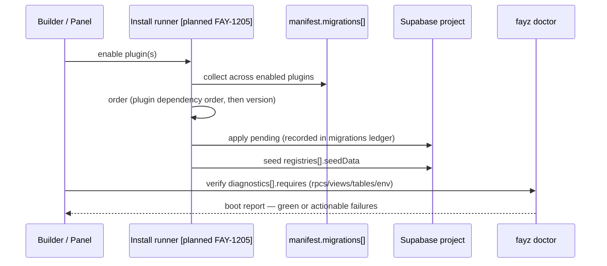
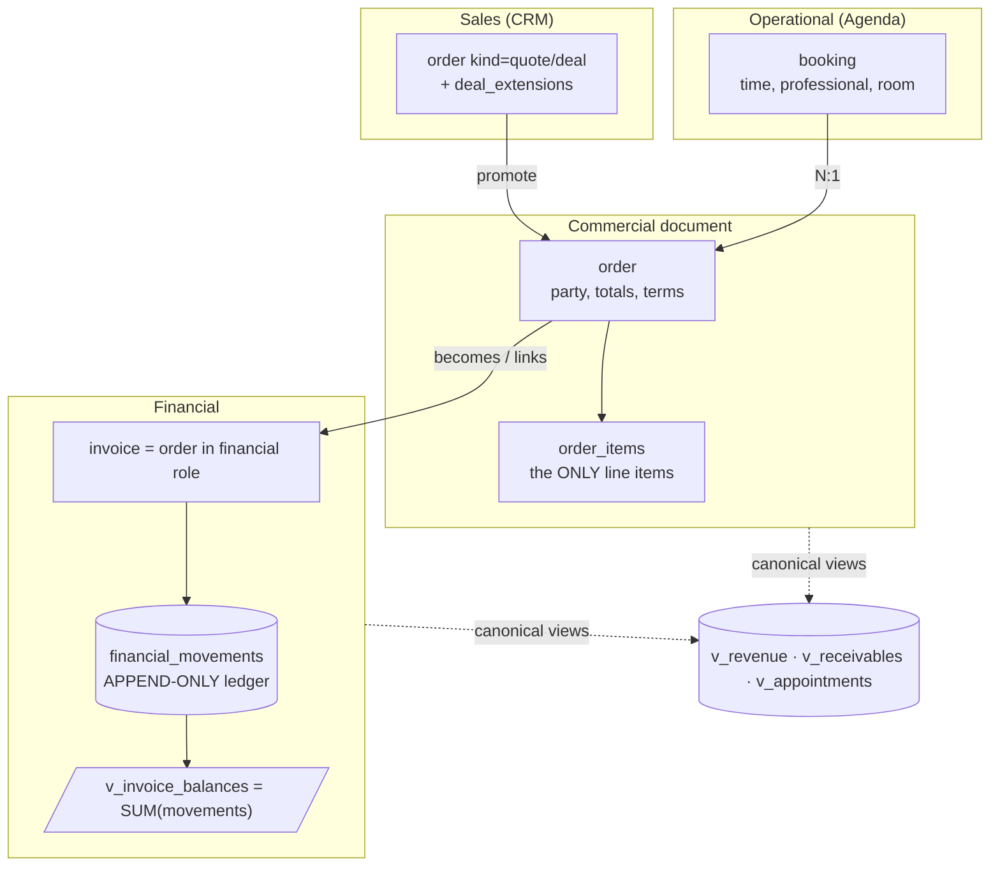
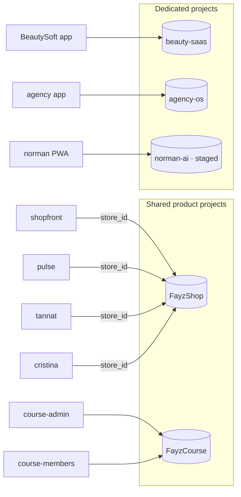

# DATA-MODEL — rings, migrations, RLS, and the Supabase topology

Status: canonical · Updated: 2026-07-06
Owner-of-truth: `packages/db/src/schema/spine.ts` + `scripts/check-plugin-capability.mjs` (RLS lock) + design RFCs `design/MIGRATION-ARCHITECTURE.md` / `design/PLUGIN-MIGRATIONS.md`

The data architecture in one sentence: **a small fixed spine of universal archetypes, plugin-owned prefixed tables around it, app-owned 1:1 extensions on top — every row tenant-scoped, every schema change delivered as a plugin migration.** This document is the canon; the two RFCs in `design/` hold the rationale and remain the deep reference.

> **Industry-pool update (2026-07).** The spine no longer lives in a dedicated `saas_core`
> schema — the industry-pool model provisions core **directly in `public`** (tables
> `public.people`, `public.orders`, `public.appointments`, …; tenant helper
> `public.user_tenant_ids()`), with plugin tables prefixed `plg_<plugin>_*` also in
> `public`. References to `saas_core.*` below and in the `design/` RFCs describe the earlier
> schema-qualified design; read them as `public.*`. The end-to-end packaging rules live in
> [PLUGIN-CONTRACT.md](./PLUGIN-CONTRACT.md).

---

## 1. The three rings



| Ring | Owner | Contents | Rule |
|---|---|---|---|
| **0** `saas_core.*` | Fayz, fixed | spine + the 5 archetypes | small and universal — **apps never add to it**; domain detail here would turn the core into a giant CRM |
| **1** `<prefix>_*` | each plugin | capability tables under the plugin's prefix | prefix = ownership + isolation boundary; provisioned by `manifest.migrations[]`; never redefines an archetype |
| **2** `public.*` extensions | the app | 1:1 id-shared extension tables + app-specific tables | may add columns and tables, must carry `tenant_id` + RLS; never a parallel entity |

### The five archetypes

Every business app is built from five nouns — this is the whole core vocabulary:

| Archetype | Table | Kind discriminator | Examples across apps |
|---|---|---|---|
| person | `saas_core.persons` | `customer` · `staff` · `lead` · `vendor` | client, professional, shopper |
| product | `saas_core.products` | `good` · `service` | SKU, menu item, course |
| service | (product, `kind='service'`) | — | haircut, retainer — a 6th table was deliberately rejected; unified pricing/catalog logic |
| location | `saas_core.locations` | `branch` · `room` · `zone` | salon unit, restaurant area |
| booking | `saas_core.bookings` | `appointment` · `reservation` · `order` | appointment, table reservation |

`kind` instead of new tables means one identity model, one search, one CRUD engine, one RLS set — and `createArchetypeLookup` routes UI by (archetype, kind). The beautyplace audit (112 production tables) mapped onto the rings with **zero changes to Ring 0** — the strongest evidence the vocabulary is right (full mapping preserved in `archive/data-model-2026-06.md`).

**`public.addresses` is spine, not commerce.** It ships in `@fayz-ai/db` (`migrations/017_core_addresses.sql`) rather than in `@fayz-ai/shop`, where the SQL physically lived until now. An address is where a client is delivered to, where a supplier is collected from, where a staff member lives — the person archetype's "Endereços" tab queries it unconditionally, so every non-shop vertical was rendering *"Could not find the table `public.addresses`"*. `owner_type` stays `text` because the owner is polymorphic (`person` · `shop_customer` · `location` · `tenant`); the spine runs before plugin migrations, so on a shop pool the plugin's own `CREATE ... IF NOT EXISTS` degrades to a no-op.

In code, the spine is declared **references-only**: `packages/db/src/schema/spine.ts` exposes `pgSchema('saas_core')` tables with just `id uuid PK` so plugin FKs typecheck; live columns are authoritative and never re-created. Plugin schemas import builders from `@fayz-ai/db` (`pgTable`, `tenantId()`, `timestamps`, `createdAt`, spine refs) — **never `drizzle-orm/pg-core` directly** (single drizzle instance rule).

## 2. Bridge views and the archetype provider

PostgREST cannot join across schemas, so cross-schema reads go through `public.v_*` views (`security_invoker = true`, so RLS still applies): each plugin/app ships views that JOIN its extension tables to the archetypes (`v_clients`, `v_staff`, `v_leads`, `v_deals`, `v_bookings`…). Naming: `v_{table}`, with the overrides map in the archetype provider.

**Report views** (the read-only aggregates consumed by `@fayz-ai/plugin-reports`) are plugin-owned, so they carry the Ring 1 prefix plus a `rep_` marker: `plg_<plugin>_rep_<métrica>` (e.g. `plg_courses_rep_revenue`). Same rules as `v_*` — `security_invoker = true`, `GRANT SELECT` to `authenticated`.

`createArchetypeProvider` (`packages/core/src/data/archetype.ts`) is the standard read/write path for archetype-backed entities: it splits writes into archetype columns (→ `saas_core.<base>`) vs project columns (→ the extension table keyed by `<fk>_id`), reads from the `v_` view (or straight from `saas_core.<base>` for pure-archetype entities where `projectTable === base`), and maps camelCase↔snake_case. Query the views, not the raw tables — reports read canonical views only (§6 invariant 4).

## 3. RLS — locked and CI-enforced

**One canonical predicate** on every tenant-scoped table:

```sql
CREATE POLICY ... USING (tenant_id IN (SELECT public.user_tenant_ids()))
```

This is **M-LOCK / L4** — not a convention, a gate. `scripts/check-plugin-capability.mjs` audits every plugin's migrations and classifies the isolation form; under `--strict`, `divergent` / `no-rls` / `other` **fail CI**. Two forms pass:

- **canonical** — the policy text inline in the plugin's migrations (plugin-tasks, plugin-forms).
- **deferred** — plugin ships `ENABLE ROW LEVEL SECURITY` without `CREATE POLICY`; the app's `project_rls.sql` auto-detect DO-block emits exactly the canonical policy at apply time for every `public` base table with a `tenant_id` column (crm, financial, inventory). Deferred lands as canonical on a real DB — a deferral of *where the text lives*, not a divergence. Generation prefers explicit canonical.

State at lock: 2 canonical · 3 deferred · 0 divergent · 0 no-rls. What RLS *presence* doesn't prove — correctness against fixtures — is [SECURITY.md](SECURITY.md) §3's job.

## 4. Cross-plugin data: links, not foreign keys

**Position (locked):** tables in one plugin's prefix **never FK-reference another plugin's prefix.** The only FKs that cross an ownership boundary point at Ring 0 spine ids. When two plugins' data must relate (a `fin_` commission references an agenda booking), the relation goes through the archetype spine (`saas_core.bookings.id`) or a link table owned by whichever plugin declares the relationship — resolved at query time, Medusa's `defineLink` discipline ([BENCHMARKS.md](BENCHMARKS.md) §4).



Why: independent install/uninstall. A tenant disabling plugin-crm must not orphan or break plugin-financial's constraints — WordPress-style plugin-interaction breakage starts with entangled schemas ([BENCHMARKS.md](BENCHMARKS.md) §1.2, §3-Odoo). `[decision-needed]`: whether to formalize a `defineLink`-style primitive in `@fayz-ai/db` or keep convention + a doctor check that scans for cross-prefix FKs — queued in [ROADMAP.md](ROADMAP.md) Appendix B.

## 5. Migrations

**Position (locked):** a plugin's schema ships as **`manifest.migrations[]`** — `PluginMigration { id, version, sql, description }`, versioned SQL strings, inspectable as data. Loose `.sql` files in a plugin's tree that are not wired into the manifest are a **contract violation**: they make the plugin lie about what installing it provisions.

Current state — the split-brain this position remediates:

| Plugin | `.sql` files | Wired into manifest | State |
|---|---|---|---|
| plugin-tasks | ✅ | ✅ | the reference (FAY-1206) |
| plugin-crm | 4 | ❌ | `[partial]` — delivered via app-side companion SQL |
| plugin-financial | 9 | ❌ | `[partial]` |
| plugin-inventory | 3 | ❌ | `[partial]` |
| plugin-forms | 2 | ❌ | `[partial]` |
| plugin-agenda | none shipped | — | worst standing violation (DECISIONS 2026-06-17) `[planned FAY-1252]` |
| 13 others | none | — | UI-only/bridge plugins — nothing to ship yet |

Remediation is Phase-1 work: wire the loose SQL into manifests (FAY-1211 audit → FAY-1252), and land the **install-time migration runner** (`[planned FAY-1205]`) that applies `manifest.migrations[]` on plugin enable:



Rules that survive any runner design:

- **Append-only once applied.** A migration that has touched any real database is immutable — fix forward with a new migration. Before first apply, edit in place (a fresh apply should yield the final shape, not base-then-patch).
- **Idempotent SQL** — DO-block guards, `IF NOT EXISTS`; plugins may be enabled into existing databases.
- **RLS canon** (§3) in every table-creating migration, or sanctioned deferral.
- **Odoo-style pre/post phasing** around schema apply for data fixups `[planned]`; **Payload-style diff-generated migrations** for AI-authored plugins is a far-horizon option `[decision-needed]` ([BENCHMARKS.md](BENCHMARKS.md) §4).
- App-level (Ring 2) migrations live in the app's `supabase/migrations/` per `design/MIGRATION-ARCHITECTURE.md`.

## 6. The order-to-cash spine (in progress)

The shared commercial model the financial/agenda/crm plugins converge on — ported from the refactor plan (S1–S6, additive-then-flip; status: in flight, verify against Linear):



**The shop is now on this spine** (`@fayz-ai/shop` 0023–0025). Placing an order raises a real receivable through `fn_invoice_from_order_internal` — the authorization-free body extracted from `fn_invoice_from_order`, because a storefront checkout runs as the *shopper*, whose `user_tenant_ids()` is empty by definition and could therefore never invoice itself. The parallel ledger the shop used to write (`public.transactions`) is **retired, not dropped**: it keeps its rows and stays the generic archetype table other verticals use; the shop simply stops being one of its writers, and its settled history was migrated across so Financeiro shows the store's whole life rather than only what happened after the bridge shipped.

The five invariants: **one writer per fact** (operational status only on `bookings`; financial status derived); **money is event-sourced** (`financial_movements` append-only; balances are views, never stored); **cross-document transitions are transactional DB functions** (`fn_invoice_from_order`, `fn_pay_invoice`) that plugins call, never re-implement; **reports read canonical views only**; **lifecycle is constrained** (kind→status matrix).

## 7. Supabase project topology — the standard

**Position (locked; de-facto proven by the dogfoods, now written down):** two tiers.

| Tier | Model | Used by | Isolation | When to choose |
|---|---|---|---|---|
| **Shared product project** | one Supabase project per *product*, many stores/tenants inside, discriminated by id | **FayzShop** (shopfront/pulse/tannat/cristina via `PUBLIC_FAYZ_STORE_ID`), **FayzCourse** (course-admin + course-members) | row-level (`store_id` / `tenant_id` + RLS) | high-volume, low-variance product instances (shops, course sites) where per-instance projects don't pay |
| **Dedicated project** | one Supabase project per SaaS app | beauty-saas, agency-os, norman-ai (staged), resto-saas | project-level (plus RLS inside for multi-tenant SaaS) | a real business's operating system: independent backup/restore, quota, and blast radius; the "your Supabase" exit story |



Decision rules for the builder ([AI-BUILDER.md](AI-BUILDER.md) §8): a *product instance* (another shop, another course site) lands in the shared project of that product; a *SaaS for a real business* gets a dedicated project. Either way the schema is the same three rings; the tiers differ only in project boundary. What this standard deliberately keeps simple: no per-domain project federation (resto's commented `VITE_FAYZ_MENU_PROJECT_ID` vars are an unadopted idea, not a direction). Provisioning automation, cost model, and project *ownership* (fayz org vs customer org) are open operational questions — [OPERATIONS.md](OPERATIONS.md) §3 and Appendix B.

## 8. Seeds and mocks

Two data tiers a plugin declares, both in the manifest: `registries[].seedData` (real reference rows provisioned at install) and `registries[].mockData` (walkable demo data). `createSafeDataProvider` gives every plugin the standard supabase-or-mock fallback so **every app ships walkable in mock mode** — the course platform's M1-mock → M2-live launch sequence (FAY-1257) is the canonical use.

## 9. Live-DB protocol (standing rule)

Lifted from DECISIONS — binding for humans and agents: **inventory + destructive-scan first; report before any destructive step; apply only additive/idempotent files.** Known landmine: `plugin-forms/002` re-runs destructively (drops `frm_documents`) — never run a full pipeline against a live DB without a skip-ledger.
