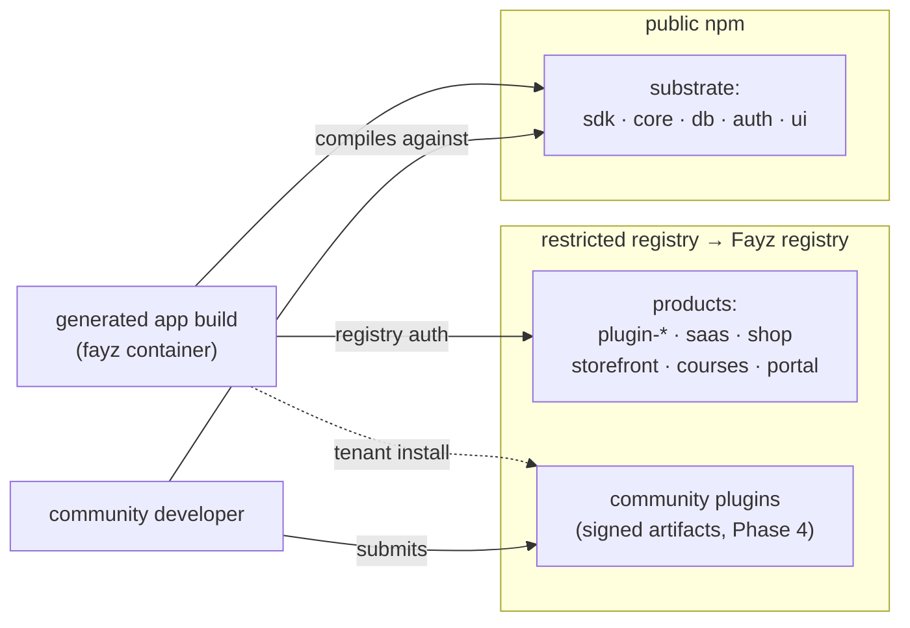
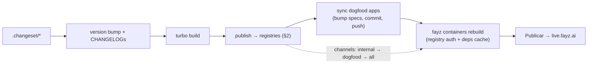

# DISTRIBUTION — registries, licensing, and release engineering

Status: canonical · Updated: 2026-07-06
Owner-of-truth: `packages/*/package.json` publish state + `.changeset/` + `packages/sdk/src/release-channels`

Who can install what is not an ops detail — it is the business model. This document owns the registry architecture, the public/private package split, licensing, release trains, and the plugin artifact pipeline the marketplace will consume.

---

## 1. 🔴 Current state — the exposure (honest baseline)

As of 2026-07-06, **every `@fayz-ai` package — including the commercial domain plugins — is published to public npm with `publishConfig.access: "public"` and `license: "MIT"`.** Verified: `npm view @fayz-ai/plugin-financial` → 0.2.0, MIT, world-readable.

What this means, precisely:

- Anyone can `npm install @fayz-ai/plugin-financial` today and read the built output of the product.
- MIT is a *forward-irrevocable grant on published artifacts*: every version already on npm remains MIT forever. Relicensing applies only to future versions; `npm unpublish` is restricted (72h window / low-usage criteria) and unreliable as a remedy.
- The competitive exposure is bounded but real: the plugins rot quickly without the platform (0.x churn, no migrations runner, no Panel, no builder), and the durable moat is **runtime coupling** — "app talks to Fayz, Fayz talks to providers" (connector credentials, edge functions, the deploy pipeline). But "our product is legally reusable by anyone" is not a position to keep.

## 2. Position — protocol public, products private

**Locked (this refactor; DECISIONS entry).** The package surface splits by role:

| Tier | Packages | Registry | License | Why |
|---|---|---|---|---|
| **Substrate (protocol)** | `@fayz-ai/sdk`, `core`, `db`, `auth`, `ui` | public npm, as today | permissive (MIT or Apache-2.0 `[decision-needed]` — Apache-2.0 adds a patent grant) | what app code, incubator plugins, and future community plugins compile against; the ecosystem wedge. An SDK nobody can install is an SDK nobody builds on |
| **Products** | `@fayz-ai/plugin-*` (all 19), `saas`, `shop`, `storefront`, `courses`, `portal` | **restricted registry** | **proprietary** (source-available commercial license) | the product. Shopify's apps are not on npm; neither are ours |

Remediation sequence (gap register, P0):

1. Flip `publishConfig.access` + license on every product package **at its next version** (the release wave already queued in `.changeset/` is the natural cut point).
2. `npm deprecate` all existing public versions of product packages with a pointer to the new channel ("this package moved to the Fayz registry").
3. Update every consumer (dogfood apps' CI, fayz editor containers) with registry auth *before* step 1 lands — see §3 consequences.
4. Do **not** attempt mass `npm unpublish` — it breaks installs retroactively and rarely succeeds; deprecation + license flip forward is the correct remedy.

`[decision-needed]` — the registry mechanism (queued, Appendix B):

| Option | Pros | Cons |
|---|---|---|
| npm restricted scope (paid org) | zero new infra; npm tooling intact | per-seat cost; token sprawl; still npm's rules |
| GitHub Packages | free-ish; org-native auth | PAT ergonomics are poor; npm-compat quirks |
| Self-hosted Verdaccio | full control; free | new infra to run and secure — before first revenue |
| **Fayz registry service (end-state)** | one distribution pipe for products AND marketplace plugins; signing, review, kill switch live in the same place | the largest build; Phase-4 scope |

Pragmatic recommendation: a restricted npm scope or GitHub Packages **now** (weeks, not months), converging on the Fayz registry when the marketplace ships ([MARKETPLACE.md](MARKETPLACE.md) §2 — the versioned install cache *is* that registry's core).



## 3. Consequences to design through

- **Editor containers**: app builds run `npm install` inside fayz platform containers with a 90s start budget and a pre-baked dependency cache. Registry auth means injecting a scoped read token into the container env and **pre-baking product packages into the deps cache** — the cache work is the same work that fixes cold-start timeouts (platform issues FAY-1260 lane). Read tokens must be read-only and rotatable.
- **Dogfood app CI** and local dev need `.npmrc` with the scoped registry line; the `/release-sdk` sync flow adds it once per app repo.
- **Community DX**: an incubator plugin author (layer C) needs only the substrate — public. They never need product plugin *source*; addon plugins compile against the host's *types* from the substrate contract. This is the test that the split is drawn correctly.
- **License files**: product packages get a `LICENSE` replacing MIT (source-available commercial — text `[decision-needed]`, needs a real legal pass before community submissions open).

## 4. Release engineering

- **Versioning**: changesets; independent package versions on a coordinated 0.x line (core/saas/ui 0.6.x, sdk 0.6.6, plugins on their own minors). Pre-1.0 semantics: minors may break, which is exactly why apps **pin exact versions** — the builder writes exact versions into generated `package.json` (container caveat FAY-1260: node_modules refresh is unreliable, so version bumps must be explicit spec changes).
- **The release train**: version bump → build → publish → **sync every dogfood app** (bump `@fayz-ai/*` specs, commit, push) → each app's fayz project rebuilds from the registry → founder clicks Publicar. Codified in the `/release-sdk` skill; DECISIONS 2026-07-02 locks that no app ever builds from local SDK source.
- **Release channels** exist in `@fayz-ai/sdk` (`release-channels` export) and are undocumented `[partial]` — they become the fleet rollout mechanism (waves: internal → dogfood → all) in [OPERATIONS.md](OPERATIONS.md) §4.
- **Peer-dep policy**: plugins peer-depend on substrate packages at the published 0.x line (never `>=1.0.0` — that was the old contributing.md drift). One version of each substrate package per app; `fayz doctor` flags duplicates.



## 5. The plugin artifact (what the marketplace distributes)

A distributable plugin is **not** "an npm tarball with extra steps" — it is a reviewed, signed artifact whose contents are exactly what the platform needs to install, verify, and revoke it:

```
plugin-artifact/
  manifest.json          serialized PluginManifest (data half: id, version, apiVersion,
                         scope, scaffolds, dependencies, entities, permissions,
                         declaredFeatures, events, migrations, diagnostics, connector metadata)
  dist/                  built JS (the code half: components, providers)
  migrations/            the SQL from manifest.migrations[] as files (auditable)
  locales/               pt-BR + en
  options.schema.json    the plugin's createXPlugin options as JSON Schema [decision-needed]
  signature              Ed25519 over the tree [planned — Phase 4]
```

First-party product plugins can ship through the same artifact pipe once it exists — one distribution mechanism, two catalogs (first-party + community). The full submission pipeline that produces these artifacts: [MARKETPLACE.md](MARKETPLACE.md) §3.

## 6. Publishing hygiene (standing rules)

- Every published package points `main`/`types` at `dist/` — `@fayz-ai/auth` currently points at `src/` `[partial — gap register]`.
- `prepublishOnly` builds; `scripts/check-published-shape.mjs` + `check-public-package-safety.mjs` guard the surface.
- `[experimental]` label in package.json for anything under the capability bar — the builder reads package metadata (invariant: advertised surface = real surface).
- No package publishes secrets, `.local` files, or app-specific config; `files:` allowlists in package.json.
