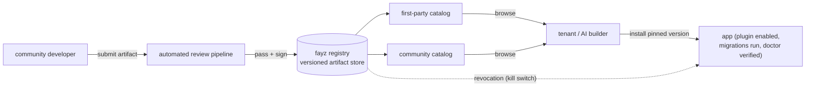
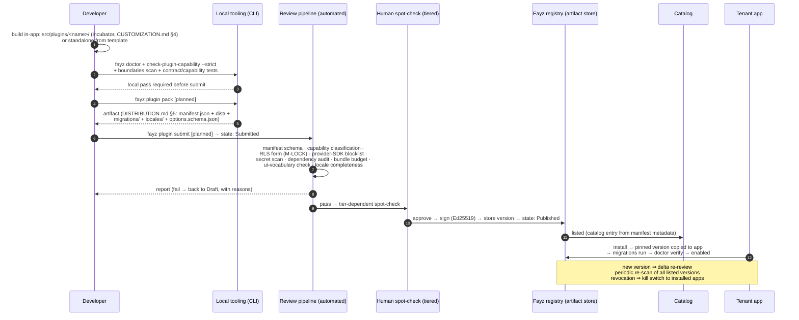

# MARKETPLACE — governance and the community submission pipeline

Status: **design — frozen until Phase 4 / first revenue** (DIRECTION.md platform freeze; FAY-1255) · Updated: 2026-07-06
Owner-of-truth: this design + [BENCHMARKS.md](BENCHMARKS.md) (the evidence it's built on)

**Zero build commitment.** This document exists during the freeze for one reason: the contracts being locked *now* (plugin manifest, artifact format, capability gate, distribution split) must not foreclose the governance model *later*. Designing the marketplace on paper costs a document; retrofitting governance onto a shipped marketplace costs an ecosystem (WordPress is the case study — [BENCHMARKS.md](BENCHMARKS.md) §1).

---

## 1. Principles

1. **Plugin ≠ marketplace.** A plugin doesn't know about catalogs; catalogs point at plugins. The same plugin can appear in multiple catalogs (first-party, community, a partner's private catalog).
2. **Installs come from a versioned cache, not from the catalog.** Installing copies a specific signed artifact version into the fayz registry's install store; catalog changes never mutate installed apps.
3. **The machine is the reviewer.** The capability contract, doctor, pattern gates, and RLS lock already encode what "a good plugin" means — the review pipeline runs them, plus supply-chain checks. Salesforce-grade rigor at automation speed ([BENCHMARKS.md](BENCHMARKS.md) §3).
4. **Review never ends at listing.** Re-scan on every new version and periodically for all listed versions; abandonment policy; revocation kill switch (the WordPress-directory and VS Code-marketplace lessons).
5. **Governance is written and procedural** — listing criteria, takedown process, dispute path, and the developer's rights are documented *before* the first third-party submission. No single-person registry fiefdom.

## 2. Topology

The fayz registry here is the same distribution end-state [DISTRIBUTION.md](DISTRIBUTION.md) §2 converges on — first-party product plugins and community plugins ship through one pipe, differing only in catalog and review tier.

## 3. The submission pipeline, end-to-end

The full journey from "customization in my app" to "listed plugin," with the artifacts at each step:

States: **Draft → Submitted → Reviewed → Published** (+ **Delisted**, **Revoked**). The CLI verbs `fayz plugin pack|submit` are named here so the artifact contract shapes them `[planned — Phase 4]`.

What the automated reviewer runs is *exactly* the first-party bar — no separate community standard: the capability gate (facets, RLS form), the pattern gates (ui vocabulary), the boundary scan (no provider SDKs, no secrets client-side), contract tests, plus supply-chain additions (dependency audit, secret scan, bundle budget, signature). A submission that would fail fayz's own CI fails review, mechanically.

## 4. Quality tiers & lifecycle policies

| Tier | Bar | Gets |
|---|---|---|
| **Listed** | automated review pass; contract + capability tests; pt-BR + en | catalog presence |
| **Built for Fayz** (earned) | capability-complete classification; composition test against golden configs; perf budget; support-responsiveness | ranking boost, badge, builder-recommendable (the AI builder only auto-suggests this tier), re-audited annually — 60-day cure window or the badge drops |

Lifecycle policies (the anti-decay set):

- **Abandonment**: no maintainer response + failing re-scan → flagged in catalog → delisted after a cure window. Installed apps keep working (versioned cache) but get a doctor warning.
- **Deprecation**: plugin API versioning applies to community plugins with the same overlap windows ([PLUGINS.md](PLUGINS.md) §6); staying on a removed API version → delisting.
- **Revocation (kill switch)**: for malicious/critically-vulnerable versions — registry marks the version revoked; platform disables it fleet-wide with tenant notification. Documented process with an appeal path, not an ad-hoc power ([BENCHMARKS.md](BENCHMARKS.md) §1.4).

## 5. Trust & execution boundaries

- v1 scope constraint (inherited from [SECURITY.md](SECURITY.md) §7): community plugins whose code runs in-app are limited to the **declarative + provider surface** (manifest UI contributions, providers over the tenant's own data through the SDK boundary). Anything needing elevated/server execution ships as an edge function reviewed with the artifact — and the long-term shape for arbitrary community *logic* is Shopify-Functions-style: declared data in, declarative ops out `[design]`.
- Signing: Ed25519 over the artifact tree; the platform verifies at install and at boot `[planned]`. Key infrastructure `[decision-needed — Appendix B]`.

## 6. Monetization

`[decision-needed — deliberately last]`: rev-share model, paid listings, and the developer payout rail. The only position taken now: **pricing must reward the Built-for-Fayz tier** (quality → distribution → revenue is the loop that keeps an ecosystem healthy — [BENCHMARKS.md](BENCHMARKS.md) §2.2), and marketplace terms are written with a real legal pass before the first paid third-party install.

## 7. The pilot

FAY-1187 (the restaurant-domain community-plugin experiment) is the designated pilot: one external-shaped plugin through the whole pipeline — incubator → graduation checklist → pack → automated review → install into a non-origin app. Success criterion: no step needed a human explaining tribal knowledge; every failure was a written check with a written fix.
