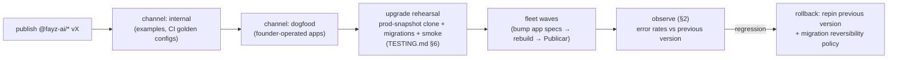

# OPERATIONS — running a fleet of live businesses

Status: design (target architecture; most mechanisms `[planned]`) · Updated: 2026-07-08
Owner-of-truth: this doc, until the mechanisms land — then the code

Day 2 is where platforms are decided: WordPress died on update chaos and operational burden; Shopify wins on "we run it" ([BENCHMARKS.md](BENCHMARKS.md) §1.5). The moment the clinic goes live, every question in this document becomes a customer-facing question. Written now — before any live customer — so the answers are designed rather than improvised.

---

## 1. What "operating" means here

A live Fayz app = a git repo + a fayz project (container build + Publicar) + a Supabase project + a set of plugin versions + tenant data. The fleet = many of those, on shared or dedicated backends ([DATA-MODEL.md](DATA-MODEL.md) §7). Fayz operates the *platform*; tenants operate their *business* through the app and the Panel.

## 2. Observability — the SDK's missing seam

**Honest state: the SDK has no logging, error-reporting, or telemetry seam.** Today, when the clinic's booking flow fails at 9am, nobody knows until the customer messages. Existing observability is narrow: `fayz doctor` (boot-time prerequisites), `SyncRun`/`*_sync_log` (connector audit), container build logs.

**Position `[planned — gap register, pre-scale]`:** a first-class, opt-in SDK seam —

- `@fayz-ai/sdk` error/log transport: structured events (app id, tenant id, plugin id, release version — never payload PII by default) shipped to a platform collector; browser `ErrorBoundary` + provider-call failures wired in by default.
- **Fleet health view** in the platform: per-app error rate, doctor status, version, last successful deploy — the operator's single pane.
- Alert path: error-rate spike → platform notification → founder/support, before the tenant notices.

Privacy note: tenant data stays in the tenant's backend; telemetry is metadata. LGPD breach-detection duties depend on this seam existing ([SECURITY.md](SECURITY.md) §4).

## 3. Provisioning & project ownership

Creating a real SaaS today includes a founder manually creating a Supabase project. At "1 prompt → working SaaS" scale this must be: Supabase Management API automation (create project, apply spine + plugin migrations, seed, store scoped keys), cost accounting (a dedicated project has a real monthly floor — the shared/dedicated decision table in [DATA-MODEL.md](DATA-MODEL.md) §7 is also a pricing decision), and quota/limit handling (free-tier pausing behavior must never surprise a paying tenant).

`[decision-needed — Appendix B]`: **who owns the Supabase project** — fayz's org (simpler ops, weaker exit story) vs the customer's org with fayz as collaborator (true "your Supabase", harder automation). This decision shapes billing, support access, and the exit promise; it should be made before the first paying dedicated-project customer.

## 4. Upgrades — the fleet lifecycle

The mechanics exist in pieces (release train in [DISTRIBUTION.md](DISTRIBUTION.md) §4; `release-channels` in `@fayz-ai/sdk` `[partial — undocumented]`); the fleet process is the design:

Policies this encodes:

- **Apps pin exact versions; upgrades are explicit spec bumps** — never silent floating (FAY-1260 container behavior makes floating actively dangerous).
- **Migration dry-run against a production snapshot before any live-fleet bump** (the rehearsal — first execution gates Wave 1).
- **Rollback story**: code rolls back by repinning; schema rolls forward-only (append-only migrations) — so any migration in a fleet release must be **additive-then-flip** ([DATA-MODEL.md](DATA-MODEL.md) §6's refactor discipline generalized). A release that can't satisfy that ships behind a flag.
- **Pinned vs tracking**: a tenant may hold a version (support window applies — versioning policy in [PLUGINS.md](PLUGINS.md) §6).
- **Pre-publish gates + canary** `[planned]`: no SDK PR merges without compiling a consumer, no publish without tarball-consumer smoke, no fleet bump without a green canary app — the executable spec is [TESTING.md](TESTING.md) §8 (ROADMAP gap #18).

## 5. Support access

`[decision-needed — Appendix B]`: the support-access model — how a fayz operator (or partner like Silvio) enters a tenant's app to help. Requirements whatever the mechanism: explicit grant or time-boxed session, **audit trail** (who, when, what), visible to the tenant, and no standing service-role backdoor. This is a trust feature to advertise, not an internal tool to hide.

## 6. Backup, export, and the exit promise

- **Backup/DR** follows the topology tier: dedicated projects get per-project backup/restore (Supabase PITR where the plan allows — part of the cost floor, §3); shared product projects need **per-store logical export** since project-level restore is collective.
- **The exit promise** — the trust wedge against Base44-style lock-in ([BENCHMARKS.md](BENCHMARKS.md) §3) is only real with tooling `[planned]`: (a) **data export** — full logical dump of a tenant's rows (spine + plugin + extension tables — the ring model makes "everything belonging to tenant X" enumerable); (b) **app export** — the repo is already the customer's code; document that it builds outside fayz (standard Vite) with the substrate packages public and product plugins licensed for continued use `[decision-needed — license terms]`; (c) a written promise in the terms. LGPD person-level export/delete ([SECURITY.md](SECURITY.md) §4) is the same machinery at finer grain — build once.

## 7. Runbooks (to write as each lands)

Incident response (detect → assess blast radius via fleet view → communicate → fix-forward) · upgrade-wave execution · tenant onboarding to a dedicated project · key rotation (Supabase keys, registry tokens, connector credentials) · abandonment handling for a failing connector/provider.
