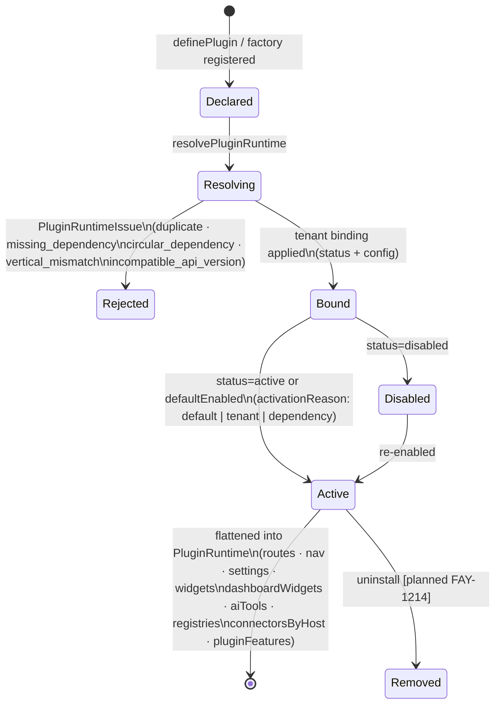
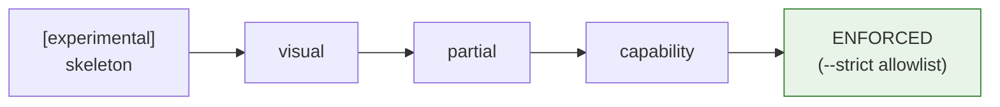

# PLUGINS — the plugin contract

Status: canonical · Updated: 2026-07-06
Owner-of-truth: `packages/core/src/types/plugins.ts` (the contract) + `packages/core/src/plugin/runtime.ts` (the runtime) + FAY-1203 (capability epic)

A plugin is the unit of product capability in Fayz: a **declarative, AI-readable manifest** plus the code it points to. Everything an app is — modules, screens, data, integrations, AI tools — arrives through this contract. This document is the architecture contract; the CI-enforced anatomy rules (folder shape, UI vocabulary, provider pattern) live in [`PLUGIN-PATTERNS.md`](PLUGIN-PATTERNS.md) — that file owns *what the gates check*, this one owns *what a plugin is*.

---

## 1. Why plugins are designed this way

Fayz needs three things simultaneously that platforms historically trade against each other:

1. **Composability** — an AI builder assembles a working vertical from parts, in one prompt.
2. **Upgradeability** — Fayz improves engines under thousands of live apps without breaking them.
3. **Freedom** — a customer's "we do it differently here" never requires forking.

The resolution is a *declarative contract with escape valves*: the manifest declares everything platform-visible (so the AI builder and the platform can reason about a plugin as data — no execution needed), while every surface accepts app-owned overrides through the ladder ([CUSTOMIZATION.md](CUSTOMIZATION.md)). The failure mode this avoids is documented in [BENCHMARKS.md](BENCHMARKS.md) §1: WordPress's untyped hooks bought composability and destroyed the other two.

In the AI era the manifest carries a second job: it is the **machine-readable capability description** the builder consumes — entities, AI tools, params, diagnostics, permissions ([AI-BUILDER.md](AI-BUILDER.md) §3). A plugin that lies in its manifest breaks the builder; hence the invariant *advertised surface = real surface* (DECISIONS 2026-07-01).

## 2. Anatomy

```
plugins/plugin-<name>/
  src/
    index.ts            createXPlugin(options): PluginManifest  (+ self-registration)
    types.ts            domain types
    data/               provider: types → mock → supabase → createSafeDataProvider
    schema/             drizzle schema via @fayz-ai/db builders
    migrations/         SQL wired into manifest.migrations[]
    components/…        UI (renders @fayz-ai/ui vocabulary only)
    locales/            pt-BR + en
  package.json          @fayz-ai/plugin-<name>; [experimental] label until at the bar
```

The ten enforced UI rules, the provider pattern (`createSafeDataProvider`), the context helper (`createPluginContext`), and the capability facets are specified in [`PLUGIN-PATTERNS.md`](PLUGIN-PATTERNS.md) and enforced by `scripts/check-plugin-patterns.mjs` + `scripts/check-plugin-capability.mjs`. `plugin-tasks` is the canonical reference implementation (FAY-1206).

## 3. Manifest reference

Source of truth: `PluginManifest` in `packages/core/src/types/plugins.ts`. Consumers: **runtime** (`resolvePluginRuntime`), **doctor** (`fayz doctor`), **builder** (the AI builder's capability discovery), **panel** (platform catalog).

| Field | Type | Required | Consumed by | Notes |
|---|---|---|---|---|
| `id` | `string` | ✅ | all | globally unique, kebab-case (`agenda`) |
| `name` | `string` | ✅ | panel/builder | display name |
| `icon` | `string` | ✅ | panel/nav | icon token |
| `version` | `string` | ✅ | panel/doctor | plugin's own semver |
| `apiVersion` | `number` | — | runtime | contract version; runtime rejects newer than `PLUGIN_API_VERSION` (= 1). Omit = legacy/compatible |
| `description` | `string` | — | panel/builder | one-liner |
| `scope` | `'core'\|'vertical'\|'universal'\|'addon'\|'tenant'` | — | runtime/builder | `addon` = extends a host plugin (e.g. a connector pack) |
| `verticalId` | `VerticalId` | — | runtime/builder | vertical gate (`beauty`, `food`, …); mismatch → `vertical_mismatch` issue |
| `scaffolds` | `ScaffoldType[]` | — | builder/panel | which app scaffolds this plugin targets (`saas`, `ecommerce`, …); omit = all. **This is also surface control**: it decides which app surface hosts the plugin (`admin` vs `storefront` vs `portal`) and therefore which Fayz Panel module tabs it unlocks — plugin-shop targets the ecommerce surface and opens the commerce operator console; agenda targets the saas/admin surface ([ARCHITECTURE.md](ARCHITECTURE.md) §4, [AI-BUILDER.md](AI-BUILDER.md) §2) |
| `events` | `PluginEventDefinition[]` | — | builder/automation | events emitted, with optional payload JSON Schema — introspection + event→action binding as data |
| `tenantId` | `string` | — | runtime | tenant-private plugin |
| `defaultEnabled` | `boolean` | — | runtime | active without an explicit tenant binding |
| `schema` | `string` | — | doctor | DB schema/prefix hint |
| `dependencies` | `string[]` | — | runtime | plugin ids; topo-sorted, missing/circular → runtime issue |
| `navigation` | `PluginNavigationEntry[]` | ✅ | shell | section (`main`/`secondary`/`settings`), position, label, route, permission |
| `settings` | `PluginSettingsTab[]` | — | shell | settings tabs; `component` **or** `componentId` |
| `routes` | `PluginRouteDefinition[]` | ✅ | router | path, `component`/`componentId`, guard (`authenticated`/`role`/`public`/`share-token`), `fullBleed` |
| `widgets` | `PluginWidgetDefinition[]` | — | shell slots | zone-targeted UI injection (§ zones below) |
| `dashboardWidgets` | `DashboardWidgetDef[]` | — | dashboard registry | kpi/chart/table/onboarding/custom; span 1–4; `surfaces` (`home`/`plugin-home`/`finance-home`); `defaultVisible`/`defaultOrder` |
| `capabilities` | `PluginCapability[]` | — | panel/builder | human-legible capability list |
| `aiTools` | `PluginAITool[]` | — | assistant/builder | JSON-schema-parameterized tools, `mode: 'read'\|'persist'`, suggestions |
| `entities` | `string[]` | — | doctor/builder | entity names this plugin owns |
| `permissions` | `string[]` | — | permissions | permission keys contributed |
| `declaredFeatures` | `FeatureDeclaration[]` | — | permissions | features gated as `{feature, action}` |
| `registries` | `PluginRegistryDef[]` | — | runtime/CRUD | `EntityDef` + `display` + `seedData`/`mockData` — declarative admin registries |
| `connectors` | `ConnectorDefinition[]` | — | ConnectorsHub | each names its `hostPluginId`; grouped into the host's Integrations tab ([CONNECTORS.md](CONNECTORS.md)) |
| `migrations` | `PluginMigration[]` | — | install runner/doctor | `{id, version, sql}` — **the** schema delivery mechanism ([DATA-MODEL.md](DATA-MODEL.md) §5) |
| `diagnostics` | `PluginDiagnostic[]` | — | doctor | `requires: {rpcs, views, tables, migrations, env}` + severity — backend prerequisites verified without running the plugin |
| `onboarding` | `PluginOnboarding` | — | shell | first-run component |
| `locales` | `Record<locale, Record<key,string>>` | — | i18n | pt-BR + en required at the capability bar |

Sub-contract details worth pinning:

- **`component` vs `componentId`** — every UI-bearing field (routes, settings, widgets, dashboardWidgets, onboarding) accepts a React component **or** a registered component id resolved through the registry (`resolvePluginComponent`). `componentId` is the indirection the AI builder and app overrides rely on. `[partial]` — `assertPluginManifestContract` in `packages/core/src/testing` still hard-requires a function for routes, rejecting componentId-only routes; fix tracked in the gap register ([ROADMAP.md](ROADMAP.md)).
- **Widget zones are a closed set** (`WidgetZone` const): `shell.sidebar.before-nav`, `shell.sidebar.footer`, `shell.topbar.start/end`, `page.before/after`, `settings.before/after`, `shell.floating`. Additions are SDK changes, not plugin choices — the Medusa injection-zone position ([BENCHMARKS.md](BENCHMARKS.md) §4). Visibility is declarative (`routes`, `roles`, `plans`, `permissions`, `when(ctx)`).
- **`DashboardSurface`** carries an app-specific value (`finance-home`, norman-ai's B2C money screen) in the core enum — a known leak of app concerns into the contract; gap-registered.
- **`PluginMigration.sql` is a string in the manifest** — inspectable data, not executable side effects at declare time. See [DATA-MODEL.md](DATA-MODEL.md) §5 for ordering, install-time execution, and the RLS canon it must follow.

## 4. Lifecycle

`definePlugin(manifest)` is an identity helper (type anchoring). Apps bind factories in `src/plugins.generated.ts` via `registerPluginFactory(id, createXPlugin)`; the app config carries `PluginRef { id, config, enabled }`; `resolvePluginRuntime({ plugins, tenantPlugins, context })` produces the runtime.



What exists today: dedup, apiVersion gate, dependency topo-sort with issue reporting, tenant bindings (`TenantPluginBinding { pluginId, status, config }`), flattening, and `PluginRuntimeProvider`/`usePluginRuntime`. What doesn't yet: an **install/uninstall lifecycle** that provisions data, permissions, and migrations at enable-time — that is the active capability epic (`[planned FAY-1203/1204/1205/1214]`) and the single most important convergence between this doc and [AI-BUILDER.md](AI-BUILDER.md) §4.

## 5. The capability contract is law

**Position (locked, FAY-1250 Phase 1):** a plugin's maturity is what `scripts/check-plugin-capability.mjs` says it is. One taxonomy, machine-derived:

| Classification | Meaning |
|---|---|
| `capability` | provider + entities + migrations + seed + permissions + tests + canonical RLS — install provisions a working module |
| `partial` | some capability facets present |
| `visual` | UI only — renders, but provisions nothing |
| `[experimental]` | package.json + README label for skeletons (DECISIONS 2026-07-01); the builder must not offer these as production-ready |

The older Solid/Partial/Early-scaffold language (previous ROADMAP) is retired. Current ratchet state: **`plugin-tasks` is the only ENFORCED plugin** (`--strict` allowlist) — the reference implementation; the gate ratchets one plugin at a time as each reaches the bar ([TESTING.md](TESTING.md) §3, [ROADMAP.md](ROADMAP.md) Phase 1).



Why this is law and not guidance: the AI builder installs plugins it has never seen a human operate. The capability contract is the machine-checkable answer to "if I enable this, does the tenant get a working module?" — which is also exactly what a marketplace review pipeline needs ([MARKETPLACE.md](MARKETPLACE.md) §3). Same gate, three consumers.

## 6. Versioning & compatibility

- **Today:** `apiVersion` (contract version, `PLUGIN_API_VERSION = 1`) gates incompatible plugins out at resolve time; each plugin also carries its own `version`. That's a floor, not a policy.
- **Position `[planned]`:** adopt Shopify-style **calendar-versioned plugin API** before community plugins exist: dated contract versions, each supported ≥12 months with ≥9 months overlap, deprecation warnings surfaced in `fayz doctor` and the builder, and marketplace delisting for plugins that stay on removed versions ([BENCHMARKS.md](BENCHMARKS.md) §2.3 — and §1.3 for what happens without this). `[decision-needed]` cadence and the first dated version — queued in [ROADMAP.md](ROADMAP.md) Appendix B.
- The npm-level release trains, channels, and pinning rules are [DISTRIBUTION.md](DISTRIBUTION.md)'s domain.

## 7. Dependencies & glue plugins

`dependencies: string[]` is implemented: topo-sorted activation, `missing_dependency`/`circular_dependency` issues, `activationReason: 'dependency'`.

**Position `[planned]`:** add Odoo-style **`autoInstall` glue plugins** — a bridge plugin that activates itself when all its trigger plugins are enabled (Odoo's `auto_install`, the mechanism behind its 30k-module composability — [BENCHMARKS.md](BENCHMARKS.md) §4). The fayz case: the AI builder enables `agenda` + `financial` for a clinic, and `agenda-financial-bridge` (deposit-on-booking, no-show fees) lights up without the builder knowing it exists. `[decision-needed]` field shape — likely `autoInstall?: { when: string[] }` — queued in Appendix B.

Addon plugins (`scope: 'addon'`) are the *directed* version of this: they name a host explicitly (openbanking → `financial`) and contribute connectors/widgets into it.

## 8. Cross-plugin composition

| Channel | State |
|---|---|
| **Events** — `events[]` declares namespaced events with payload schemas | declared: introspectable; delivery: apps use `window` CustomEvents (beauty's `agenda:open-booking`) `[partial]` — a typed event bus consuming these declarations is the named seam `[planned — gap register]` |
| **Data** — cross-plugin reads/writes | **no cross-plugin foreign keys**; links + archetype spine ([DATA-MODEL.md](DATA-MODEL.md) §4) |
| **UI** — contributing into another plugin's surfaces | connectors into a host's Integrations tab; `dashboardWidgets` onto shared surfaces — **opt-in or surface-scoped, never broadcast** (the one architectural rule; FAY-1247 post-mortem) |
| **Behavior** — extending another plugin's logic | provider injection through the plugin's `dataProvider` seam (resto menu precedent); never patching another plugin's internals ([BENCHMARKS.md](BENCHMARKS.md) §3, the Odoo lesson) |

## 9. AI legibility

The manifest fields the builder reads, and what it does with them (full protocol: [AI-BUILDER.md](AI-BUILDER.md)):

| Field | Builder use |
|---|---|
| `scope`, `verticalId`, `scaffolds` | plugin selection for a prompt |
| `description`, `capabilities` | matching user intent to modules |
| `entities`, `registries` | knowing what data exists without reading source |
| `aiTools` | exposing plugin operations to the in-app assistant (and norman-agent-style backends) |
| `events` | wiring event→action automations as data |
| `declaredFeatures`, `permissions` | role setup at install |
| `migrations`, `diagnostics` | install-time provisioning + post-install verification |
| `settings`, `onboarding` | what to tell the tenant to configure |
| package.json `[experimental]` label | production-readiness gate |

`[decision-needed]`: export each plugin's **options JSON Schema** (derived from the `createXPlugin(options)` types) so the builder fills params without reading source — Appendix B.

## 10. Authoring a plugin

- **Official plugin (layer D):** lives in `plugins/plugin-<name>/`, follows [`PLUGIN-PATTERNS.md`](PLUGIN-PATTERNS.md), targets the capability bar from day one, peer-depends on the substrate at the published 0.x line, ships pt-BR + en locales, and registers in the workspace. Distribution and licensing rules: [DISTRIBUTION.md](DISTRIBUTION.md).
- **App-local / incubator plugin (layer C):** `fayz create plugin <name>` scaffolds `src/plugins/<name>/` in the app with the same contract; see [CUSTOMIZATION.md](CUSTOMIZATION.md) §4 for the two proven styles and the graduation checklist. There is deliberately nothing an official plugin can do that an app-local one can't — that symmetry is what makes graduation a packaging move, not a rewrite.
- **Community plugin:** same contract + the submission pipeline in [MARKETPLACE.md](MARKETPLACE.md) `[design — frozen until Phase 4]`.

Integrity floor for any of the three: `assertPluginManifestContract` + `assertConnectorContract` from `@fayz-ai/core/testing` (id/name/icon/version present, nav↔route wiring, no duplicate route paths, renderable settings tabs).

## 11. Migrations

One sentence, because [DATA-MODEL.md](DATA-MODEL.md) §5 owns it: **a plugin's schema ships as `manifest.migrations[]` — versioned SQL strings following the RLS canon — and loose `.sql` files not wired into the manifest are a contract violation** (current offenders and remediation in the state table there).
