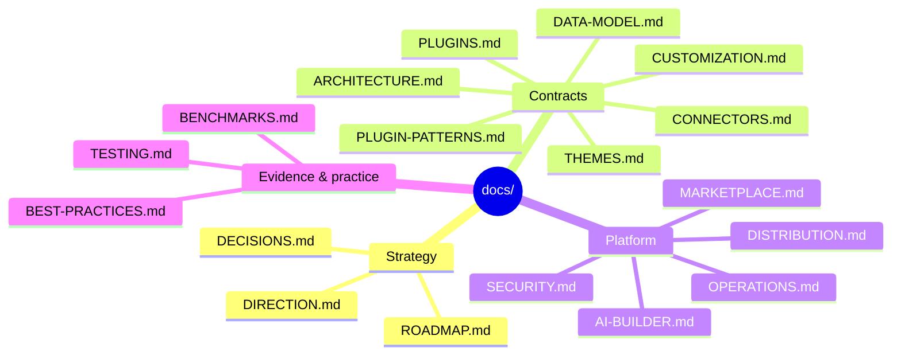

# fayz-sdk documentation

Status: canonical · Updated: 2026-07-06
Owner-of-truth: this folder

The canonical documentation set for the Fayz SDK — the package layer every Fayz app is built on, and the contracts the Fayz AI builder operates against. UPPERCASE documents are canon; folders hold supporting material.

## Doc map

| Document | What it answers | Status |
|---|---|---|
| [ARCHITECTURE.md](ARCHITECTURE.md) | What fayz-sdk is, package topology, boundaries, invariants | canonical |
| [PLUGINS.md](PLUGINS.md) | The plugin contract: manifest, lifecycle, capability, versioning | canonical |
| [PLUGIN-PATTERNS.md](PLUGIN-PATTERNS.md) | The CI-enforced plugin anatomy rules (what the gates check) | canonical |
| [CUSTOMIZATION.md](CUSTOMIZATION.md) | The 7-level ladder, component contracts, incubator plugins | canonical |
| [DATA-MODEL.md](DATA-MODEL.md) | Rings, migrations, RLS canon, Supabase project topology | canonical |
| [CONNECTORS.md](CONNECTORS.md) | The integration spine and the connector standard | canonical |
| [DISTRIBUTION.md](DISTRIBUTION.md) | npm/registry architecture, public/private split, release trains | canonical |
| [SECURITY.md](SECURITY.md) | Threat model, RLS verification, LGPD, secrets, supply chain | canonical |
| [THEMES.md](THEMES.md) | Theme contract, tokens, design system as contract | canonical |
| [TESTING.md](TESTING.md) | Per-layer test strategy, capability tests, composition testing | canonical |
| [OPERATIONS.md](OPERATIONS.md) | Fleet observability, upgrades, support, backup, export | design |
| [BEST-PRACTICES.md](BEST-PRACTICES.md) | The twelve rules + the enforcement map | canonical |
| [BENCHMARKS.md](BENCHMARKS.md) | Ecosystem evidence: WordPress, Shopify, Medusa, Odoo, Base44 | reference |
| [MARKETPLACE.md](MARKETPLACE.md) | Marketplace governance + community submission pipeline | design (frozen) |
| [AI-BUILDER.md](AI-BUILDER.md) | The builder ⇄ SDK app contract (install, configure, customize, migrate) | canonical, versioned |
| [ROADMAP.md](ROADMAP.md) | Milestones, feasibility assessment, gap register, decision queue | roadmap |
| [DIRECTION.md](DIRECTION.md) | Strategy: thesis, waves, platform freeze | canonical |
| [DECISIONS.md](DECISIONS.md) | ADR-lite decision log (newest first) + standing rules | canonical |

Supporting folders: [`design/`](design/) (RFCs and integration briefs — rationale, not canon), [`checkpoints/`](checkpoints/) (dated work logs, immutable), [`archive/`](archive/) (superseded docs with tombstones — see its [ledger](archive/README.md)).

Root-level companion: [`/AGENTS.md`](../AGENTS.md) (agent operating manual).

## Reading order

**Humans, first contact:** [DIRECTION.md](DIRECTION.md) → [ARCHITECTURE.md](ARCHITECTURE.md) → the domain doc you need.

**Agents and the AI builder:** [AI-BUILDER.md](AI-BUILDER.md) → [PLUGINS.md](PLUGINS.md) → [DATA-MODEL.md](DATA-MODEL.md), with [DECISIONS.md](DECISIONS.md) as the tie-breaker when docs disagree (newest entry wins).



## Status-label grammar

Every canonical doc opens with a header block:

```
Status: canonical | design | roadmap · Updated: YYYY-MM-DD
Owner-of-truth: <code path or Linear epic this doc mirrors>
```

Inside a doc, claims carry greppable labels:

- **(no label)** = `[implemented]` — in code, verified against the tree.
- **`[partial]`** — exists but incomplete; the label names what's missing.
- **`[planned FAY-xxxx]`** — roadmap; cites the Linear issue.
- **`[decision-needed]`** — open question; every one is echoed in [ROADMAP.md](ROADMAP.md) Appendix B.

Rules: anything unlabeled is implemented; any claim about CI enforcement must cite the enforcing script (`scripts/check-plugin-capability.mjs`, `scripts/check-plugin-patterns.mjs`, `cli/src/lib/boundaries.ts`, `fayz doctor`). This grammar is the mechanism that keeps these docs honest — a doc that over-promises against code reality is a bug.

## Archive policy

When a doc is superseded: (1) `git mv` it to `archive/<name>-<YYYY-MM>.md`; (2) prepend a tombstone (`> **ARCHIVED <date>** — superseded by [X]. Historical reference only.`); (3) add a row to [archive/README.md](archive/README.md); (4) grep the repo for inbound links and repoint them. Nothing is deleted; history is rationale-mining material.
