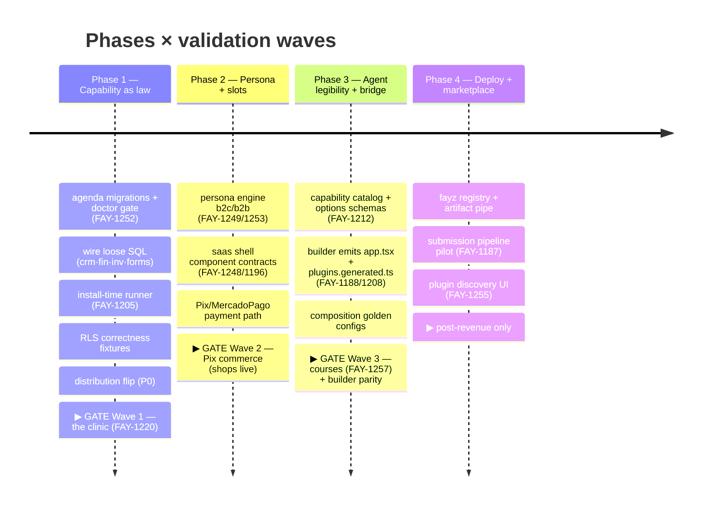

# ROADMAP — milestones, feasibility, gaps, decisions

Status: roadmap · Updated: 2026-07-06
Owner-of-truth: FAY-1250 (phases) + FAY-1220/1257/1221 (launch gates) + this doc for the aggregated registers

This crystallizes the existing plan (FAY-1250's phases, DIRECTION.md's waves) — it does not invent a new one. What it adds: exit criteria tied to the real-customer launches, a global-scale feasibility assessment, and the two registers every other doc feeds (gaps and open decisions).

---

## 1. Where we are (2026-07-06)

The July-2026 architect audit scorecard (FAY-1250), unchanged until the phase work moves it:

| Dimension | Score | The one-line reason |
|---|---|---|
| Contract consistency | 4/10 | contract exists; 1/19 plugins enforced |
| Data & migrations | 4/10 | rings + RLS locked; migration delivery split-brain (§4) |
| Persona engine | 3/10 | hand-rolled presets only |
| SaaS slots | 3/10 | WidgetZone yes; shell component contracts no |
| Tests | 2/10 | see [TESTING.md](TESTING.md) §1 |
| **Builder ⇄ SDK bridge** | **2/10** | generator emits zero `@fayz-ai` — [AI-BUILDER.md](AI-BUILDER.md) is the fix's spec |

Live capability census (from `check-plugin-capability.mjs`, 2026-07-06): **1 capability · 13 partial · 5 visual**; RLS forms **4 canonical · 1 deferred · 0 divergent** (full table: Appendix A). Plus the freshly verified distribution exposure: all packages public npm + MIT ([DISTRIBUTION.md](DISTRIBUTION.md) §1).

Standing constraints (DECISIONS 2026-07-02): platform freeze — no speculative surface until first revenue; no new dogfood apps; abstractions pull-only; marketplace UI only on top of a provable contract.

## 2. Milestones

Phases are FAY-1250's; each is bound to the launch it unblocks. Phase 0 (Subtract) completed 2026-07-01.

**Exit criteria per milestone** (the "done means" list):

- **M1 — Capability as law** *(gates the clinic going live)*: the Wave-1 plugin set (agenda, financial, crm, forms, tasks) classified `capability` and in the `--strict` allowlist; `manifest.migrations[]` wired for all five (no ⚠ in the census); install-time runner applied on at least one real project; RLS correctness fixtures passing ([SECURITY.md](SECURITY.md) §3); product packages off public-MIT ([DISTRIBUTION.md](DISTRIBUTION.md) §2 steps 1–3); the upgrade rehearsal executed once against a beauty snapshot.
- **M2 — Persona + slots** *(gates shops/commerce wave)*: persona presentation defaults derived at `defineSaas` (norman and beauty from the same plugins, no hand-rolled env presets); shell slots with published contracts (the "custom menu" case lands at ladder 3–5, not escalation); one real Pix payment through the guardrailed path.
- **M3 — Agent legibility + bridge** *(gates "1 prompt → working app" claims)*: builder generates a course/shop app that passes `check-generated-*` + doctor with **zero manual fixes**; capability catalog consumed by the builder (no source-reading); manifest derivation automated (§2 of AI-BUILDER); composition CI green on the golden configs.
- **M4 — Deploy + marketplace** *(post-revenue)*: FAY-1187 pilot through the full submission pipeline; fayz registry serving both product and community artifacts; Built-for-Fayz tier defined with its first re-audit scheduled.

## 3. Feasibility — can this scale globally?

**Verdict: yes, conditionally — the architecture is sound and now documented; the risk is operational, not conceptual.** The audit's 7/10 feasibility holds. What must be true at each order of magnitude:

| Scale | What breaks first without the listed work |
|---|---|
| **~10 live apps** (the waves) | RLS correctness + LGPD posture (real customer data); migration split-brain (two delivery paths = drift); observability seam (support is blind — [OPERATIONS.md](OPERATIONS.md) §2); distribution flip (every new app deepens the MIT exposure) |
| **~100 apps** | fleet upgrade waves + rehearsal discipline (manual per-app bumps stop scaling); Supabase provisioning automation + project-ownership decision; composition CI (manual cross-consumer checks stop scaling); plugin lazy-loading/bundle budgets (12-plugin apps ship everything eagerly today) |
| **~1k apps** | versioned plugin API with overlap windows (unversioned contract changes become Gutenberg); capability catalog as the builder's only source (prose drifts); fleet health dashboard; per-store export tooling on shared projects |
| **~10k apps + community** | marketplace governance end-to-end (review/re-scan/kill switch); real execution boundary for third-party logic; multi-region data residency; i18n beyond pt-BR/en; per-country payment/fiscal rails (NFSe is Brazil-only — each country is a connector portfolio, which the connector standard makes tractable) |

Structural advantages the assessment leans on (why "yes"): the audited-engines security model beats per-app generated code ([BENCHMARKS.md](BENCHMARKS.md) §3); upgrades-by-contract beats regeneration; the ring data model makes tenant export/isolation enumerable; and none of the AI-builder competitors has third-party extensibility — the open flank.

## 4. Gap register (pre-launch fixes, aggregated from all docs)

| # | Gap | Doc | Linear | Priority |
|---|---|---|---|---|
| 1 | 🔴 Product packages public on npm under MIT | [DISTRIBUTION.md](DISTRIBUTION.md) §1 | *(new — file)* | P0, before Wave 1 |
| 2 | Migration split-brain: crm/financial/forms/inventory `.sql` not wired into manifests (⚠ in census); agenda ships none | [DATA-MODEL.md](DATA-MODEL.md) §5 | FAY-1252 / FAY-1211 | P1, M1 |
| 3 | Install-time migration runner | [DATA-MODEL.md](DATA-MODEL.md) §5 | FAY-1205 | P1, M1 |
| 4 | RLS correctness fixtures (presence ≠ correctness) | [SECURITY.md](SECURITY.md) §3 | *(new — file)* | P1, gates clinic |
| 5 | SDK observability seam (no logging/error transport) | [OPERATIONS.md](OPERATIONS.md) §2 | *(new — file)* | P1, before paying customers |
| 6 | `componentId` accepted by contract, rejected by validator (blocks registry-indirect routes) | [PLUGINS.md](PLUGINS.md) §3 | *(new — file)* | P2, blocks AI-BUILDER §3 |
| 7 | Typed event bus consuming `events[]` declarations (apps use window CustomEvents) | [PLUGINS.md](PLUGINS.md) §8 | FAY-1196 lane | P2 |
| 8 | `fayz extract` detects deleted `createSaasApp`; manifest derivation not automated | [AI-BUILDER.md](AI-BUILDER.md) §2 | FAY-1188 | P2, M3 |
| 9 | Persona engine (replace hand-rolled presets) | [THEMES.md](THEMES.md) §4 | FAY-1249/1253 | P2, M2 |
| 10 | `@fayz-ai/auth` publishes `src/` not `dist/` | [DISTRIBUTION.md](DISTRIBUTION.md) §6 | *(new — file)* | P2 |
| 11 | `@fayz-ai/app-runtime` deprecated-but-present | [ARCHITECTURE.md](ARCHITECTURE.md) §2 | *(new — file)* | P3 |
| 12 | `finance-home` app value in the core `DashboardSurface` enum | [PLUGINS.md](PLUGINS.md) §3 | *(new — file)* | P3 |
| 13 | Dual `createCrudPage`/`createNativeCrudPage` mid-migration | saas de-bridge lane | *(existing lane)* | P3 |
| 14 | Plugin lazy-activation / bundle budgets | feasibility §3 | *(new — file)* | P2, before 20 plugins |
| 15 | Connector credential record convergence (per-connector tables → shared shape) | [CONNECTORS.md](CONNECTORS.md) §3 | *(new — file)* | P3 |

*(Resolved during this refactor's audit: the `credentials.local` scare — file was never committed, gitignore covers `*.local`; no rotation required.)*

## 5. Blind spots (what the plan wasn't watching — now it is)

Each got a home in the doc set: **(0)** the npm/MIT exposure → DISTRIBUTION §1; **(1)** day-2 fleet lifecycle → OPERATIONS §4; **(2)** runtime observability/support loop → OPERATIONS §2/§5; **(3)** Supabase provisioning economics + project ownership → OPERATIONS §3; **(4)** RLS correctness + LGPD → SECURITY §3/§4; **(5)** plugin loading performance → gap #14; **(6)** machine-readable capability catalog + builder eval loop → AI-BUILDER §3 + doctor-as-gate; **(7)** versioning/deprecation policy timing → PLUGINS §6 (write it before community plugins exist); **(8)** exit/export tooling behind the "your Supabase" promise → OPERATIONS §6.

## Appendix A — plugin maturity census

Generated from `node scripts/check-plugin-capability.mjs` (2026-07-06) — **regenerate, don't hand-edit**; the script output is the source of truth. ⚠ in *mig* = `.sql` present but not wired into the manifest.

| Plugin | prov | ent | mig | seed | perm | test | rls | Class | Needs for capability |
|---|---|---|---|---|---|---|---|---|---|
| plugin-tasks | ✓ | ✓ | ✓ | ✓ | · | ✓ | ok | **capability** (ENFORCED) | — |
| plugin-agenda | ✓ | ✓ | · | · | ✓ | ✓ | · | partial | seed (+ migrations — the standing violation) |
| plugin-crm | ✓ | ✓ | ⚠ | ✓ | ✓ | · | ok | partial | wire-migrations, tests |
| plugin-financial | ✓ | ✓ | ⚠ | ✓ | ✓ | ✓ | ok | partial | wire-migrations |
| plugin-forms | ✓ | ✓ | ⚠ | ✓ | ✓ | · | ok | partial | wire-migrations, tests |
| plugin-inventory | ✓ | ✓ | ⚠ | ✓ | ✓ | · | def | partial | wire-migrations, tests |
| plugin-menu | ✓ | ✓ | · | ✓ | · | · | · | partial | tests |
| plugin-orders | ✓ | ✓ | · | ✓ | · | · | · | partial | tests |
| plugin-tables | ✓ | ✓ | · | ✓ | · | · | · | partial | tests |
| plugin-conversations | ✓ | · | · | · | ✓ | · | · | partial | entities, seed, tests |
| plugin-courses | ✓ | · | · | · | ✓ | · | · | partial | entities, seed, tests |
| plugin-marketing | ✓ | · | · | · | ✓ | · | · | partial | entities, seed, tests |
| plugin-reports | ✓ | · | · | · | ✓ | · | · | partial | entities, seed, tests |
| plugin-shop | ✓ | · | · | · | · | · | · | partial | entities, seed, tests |
| plugin-auth | · | · | · | · | · | · | · | visual | — (bridge plugin) |
| plugin-automations | · | · | · | · | ✓ | · | · | visual | — |
| plugin-dashboard | · | · | · | · | ✓ | · | · | visual | — (widget engine host) |
| plugin-reputation | · | · | · | · | ✓ | · | · | visual | — |
| plugin-sites | · | · | · | · | ✓ | · | · | visual | — |

`[experimental]`-labeled (DECISIONS 2026-07-01): reports, conversations, shop, dashboard, courses, automations, reputation, sites.

## Appendix B — decision queue

Every `[decision-needed]` across the doc set. Locking one = a [DECISIONS.md](DECISIONS.md) entry + removing the label at its source.

| # | Decision | Blocked doc/section | Suggested forum & timing |
|---|---|---|---|
| 1 | Registry mechanism (restricted npm scope / GitHub Packages / Verdaccio / fayz registry first) | DISTRIBUTION §2 | founder, with M1 (P0 remediation) |
| 2 | Substrate license: keep MIT vs Apache-2.0; product commercial-license text | DISTRIBUTION §2/§3 | founder + legal, with #1 |
| 3 | Plugin API version cadence + first dated version | PLUGINS §6 | before community plugins (M3/M4 boundary) |
| 4 | `autoInstall` glue-plugin field shape | PLUGINS §7 | design with the first real bridge plugin (M2) |
| 5 | Cross-plugin link primitive: formal `defineLink` in `@fayz-ai/db` vs convention + doctor scan | DATA-MODEL §4 | when the first cross-plugin relation ships |
| 6 | OAuth broker location (platform service vs per-app edge fn) | CONNECTORS §3 | with the second OAuth connector |
| 7 | Per-plugin options JSON Schema export + generated capability catalog | AI-BUILDER §3 | M3 kickoff (FAY-1212's deliverable shape) |
| 8 | Typed runtime client (Base44-style, typed) — build or stay providers-only | AI-BUILDER §10 | revisit when level-6+ generated code is the measured bottleneck |
| 9 | Payload-style diff-generated migrations for AI-authored plugins | DATA-MODEL §5 | far horizon |
| 10 | Marketplace signing/key infrastructure | MARKETPLACE §5 | Phase 4 |
| 11 | Marketplace monetization / rev-share | MARKETPLACE §6 | Phase 4, with legal |
| 12 | Supabase project ownership (fayz org vs customer org) | OPERATIONS §3 | before first paying dedicated-project customer |
| 13 | Support-access/impersonation model | OPERATIONS §5 | before Wave-1 support reality |
| 14 | LGPD DPA approach + retention defaults | SECURITY §4 | counsel, gates the clinic |
| 15 | `fayz migrate`/`fayz upgrade` CLI wrappers: build timing | AI-BUILDER §7 | after FAY-1205 lands |
