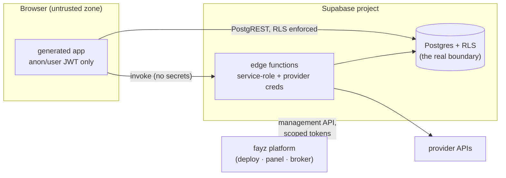

# SECURITY — threat model, RLS correctness, LGPD, secrets, supply chain

Status: canonical · Updated: 2026-07-06
Owner-of-truth: `scripts/check-plugin-capability.mjs` (RLS lock) + `cli/src/lib/boundaries.ts` (provider blocklist) + this doc for policy

Fayz hosts **other businesses' customer data** — a clinic's client records, a creator's buyers, shops' orders. Security here is not a best-practice section; it is a launch gate. The structural bet ([BENCHMARKS.md](BENCHMARKS.md) §3): generated apps that *compose audited engines with security in the contract* avoid the fate of both WordPress (plugins = >90% of vulnerabilities) and the AI-builder cohort (Lovable's CVE-2025-48757: 170+ generated apps with broken RLS). That bet only pays if the auditing is real — this document defines it.

---

## 1. Threat model

| Threat | Vector | Primary control |
|---|---|---|
| Cross-tenant data leak | missing/wrong RLS; view without `security_invoker`; service-role key in the wrong place | RLS canon + M-LOCK gate (§3); topology isolation ([DATA-MODEL.md](DATA-MODEL.md) §7) |
| Credential theft | provider tokens reaching the browser; secrets in repo/env committed | data-plane-only credentials ([CONNECTORS.md](CONNECTORS.md) §3); secrets rules (§5) |
| Malicious/vulnerable plugin | third-party code in-app; abandoned plugins | manifest capability declaration; marketplace review + re-scan + kill switch `[design — MARKETPLACE.md]`; real isolation boundary for untrusted logic `[planned]` |
| Generated-code vulnerability | builder emitting bespoke auth/payment/query code | guardrailed money paths (§6): those surfaces are SDK engines, never generated |
| Supply chain | compromised package/publish; dependency confusion | restricted registry + provenance ([DISTRIBUTION.md](DISTRIBUTION.md)); artifact signing `[planned — Phase 4]` |
| Platform operator abuse / account takeover | support impersonation without audit; weak tenant-member auth | support-access model with audit trail `[decision-needed — OPERATIONS.md]`; app-owned RBAC |

The invariant the diagram encodes: **the browser never holds anything more powerful than a user JWT.** Service-role keys and provider credentials exist only in edge functions and the platform. Anything that would require otherwise is a design error.

## 2. Tenant isolation

Isolation is layered ([DATA-MODEL.md](DATA-MODEL.md)): project-level (dedicated Supabase projects for SaaS apps), row-level (the RLS canon on every `tenant_id` table, `store_id` discrimination in shared product projects), and app-level (permissions/RBAC: `declaredFeatures` + `PermissionGate` — deny-by-default in multi-tenant). The 2026-07-02 decision that the clinic runs the FULL beauty-saas (no lite fork) was made *because* RLS now covers every `tenant_id` table — isolation quality is what makes shared deployments safe at all.

## 3. RLS: presence is not correctness

The Lovable CVE's second act is the instructive part: their scanner checked that RLS was *enabled*, not that policies were *right* — apps passed the check and still leaked. Fayz's layers:

1. **Presence + form (enforced today):** the M-LOCK gate (`check-plugin-capability.mjs --strict`) fails CI on any plugin migration whose isolation form isn't the canonical predicate (or sanctioned deferral) — [DATA-MODEL.md](DATA-MODEL.md) §3.
2. **Correctness (`[planned]` — pre-go-live gate):** execute policies against fixtures — two tenants, cross-tenant read/write attempts per table, service-role and anon paths, view `security_invoker` verification. Belongs in the capability test suite ([TESTING.md](TESTING.md) §3) and in `fayz doctor`'s live checks. Until this exists, RLS review on a new table is a **manual checklist item** for anything touching real customer data.
3. **Live posture:** `fayz doctor` diagnostics verify required RPCs/views/tables exist per plugin; the gap register tracks adding policy-presence live checks.

## 4. LGPD (the clinic gate)

The first real customers are Brazilian businesses holding personal data — a clinic's client base is personal and potentially sensitive (health-adjacent). Before any real-customer go-live, the minimum posture `[planned — launch gate]`:

- **Roles**: the tenant (clinic/creator/shop) is the *controladora*; Fayz is the *operadora* (data processor). This must be written into terms — a DPA (data processing agreement) template is needed `[decision-needed — legal]`.
- **Rights plumbing**: export of a person's data and hard-delete on request — maps directly to archetype-centric data (persons + extensions + plugin rows keyed by spine ids make "everything about person X" tractable — a real payoff of the ring model). Export/delete tooling is the same machinery as the exit story ([OPERATIONS.md](OPERATIONS.md) §6).
- **Minimization & retention**: plugins collect only declared entities; retention defaults per vertical `[decision-needed]`.
- **Breach process**: detection depends on observability ([OPERATIONS.md](OPERATIONS.md) §2 — currently the SDK has no error/log seam, which is also a security gap: you cannot report what you cannot see).
- **Consent surfaces** where marketing plugins process contactable data.

This section is deliberately a posture, not legal advice — it defines what the *architecture* must support so counsel has something real to sign off on.

## 5. Secrets

- **Never in the repo.** `.gitignore` covers `*.local`; the `docs/dogfood-sprint/credentials.local` scare (2026-07-06 audit: file was local-only, never committed — confirmed via git history) still sets the rule: working credentials live in untracked `*.local` files or platform secret stores, nowhere else.
- **Never in the browser** (§1). `ConnectionConfig.settings` never carries secrets; connector credentials live server-side, encrypted, tenant-scoped ([CONNECTORS.md](CONNECTORS.md) §3).
- **Env discipline**: apps use publishable/anon keys client-side (`VITE_SUPABASE_URL` + anon or `sb_publishable_`); service-role keys exist only in edge function env; registry read tokens in CI/containers are read-only and rotatable ([DISTRIBUTION.md](DISTRIBUTION.md) §3).
- **Doctor checks env**: `PluginDiagnostic.requires.env` lets a plugin declare required env without ever printing values.

## 6. Money-path guardrails

From Shopify's checkout lesson ([BENCHMARKS.md](BENCHMARKS.md) §2.1, §2.6): the surfaces where the tenant's money or identity is at stake are **constrained zones** —

| Surface | Rule |
|---|---|
| Payments/checkout (MercadoPago/Pix, Stripe billing) | SDK engines + edge-function webhooks only; idempotent webhook handling; amounts derived server-side; **never generated or app-local code** |
| Auth & session | `@fayz-ai/auth` adapters only |
| Tenancy & RLS | the canon; no app-authored policies outside the sanctioned deferral |
| Provider credentials | data plane only |
| The financial ledger | append-only `financial_movements`; balances derived, never stored ([DATA-MODEL.md](DATA-MODEL.md) §6) |

Whatever the prompt says, the builder routes changes to these surfaces as SDK work ([AI-BUILDER.md](AI-BUILDER.md) §6). Everything else — UI, themes, workflows, custom entities — is the freedom zone.

## 7. Supply chain & future community code

- Today all in-app code is first-party or app-owned (layer C) — the trust boundary is the repo review and the boundaries scan.
- When community plugins arrive ([MARKETPLACE.md](MARKETPLACE.md)): signed artifacts (Ed25519 over the tree), automated review at submission, **continuous re-scan and revocation** (the VS Code lesson: scanning once is not enough), abandonment policy, and — for plugin business logic that isn't just declarative UI — a real execution boundary (edge function / WASM in the Shopify Functions shape: declared data in, declarative ops out). JS-level sandbox conventions are explicitly not a plan (Figma's Realms escape, [BENCHMARKS.md](BENCHMARKS.md) §3).
- **The reputational rule**: the platform owns the outcome. When a plugin fails, tenants experience "Fayz failed." Review rigor, kill switches, and the capability contract are how the platform earns the right to say "install this."
