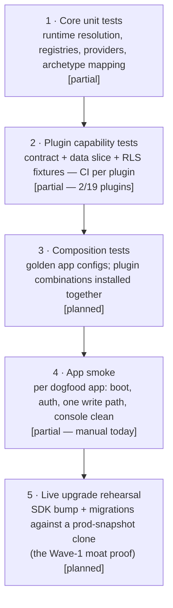

# TESTING — the per-layer strategy

Status: canonical · Updated: 2026-07-06
Owner-of-truth: `scripts/check-plugin-capability.mjs` + `packages/core/src/testing` + FAY-1250 (tests scored 2/10)

Honest baseline first: the July-2026 foundation audit scored testing **2/10**. What exists is real but thin — this document defines the target pyramid and the order in which it gets built, tied to the launch gates rather than to coverage vanity.

---

## 1. What exists today

- **Contract-integrity assertions** — `assertPluginManifestContract` + `assertConnectorContract` (`@fayz-ai/core/testing`): id/name/icon/version present, nav↔route wiring, no duplicate routes, renderable settings tabs. Cheap, universal, run in plugin test suites.
- **Capability tests** — `plugins/{plugin-tasks,plugin-financial}/src/data/capability.test.ts`: prove the data slice end-to-end on the mock provider. plugin-tasks is the reference (FAY-1206).
- **Static gates** — `check-plugin-capability.mjs` (facets + RLS form; `--strict` ratchet), `check-plugin-patterns.mjs` (UI anti-drift), `check-public-surface/published-shape/package-safety`, generated-app checks (`check-generated-*.mjs`), boundary scan (`cli/src/lib/boundaries.ts`).
- **Unit tests** — vitest via `turbo test` (sdk and pockets of core); node `--test` for the check scripts themselves.
- **The green rule** — "green" = typecheck + build + **dev-smoke** (serve a module, console clean); type-green alone has shipped broken dev servers (DECISIONS standing rule).

## 2. The target pyramid

## 3. Capability tests as law (level 2)

Phase-1 rule: **a plugin reaches the capability bar only with capability tests** — the facet is one of the seven `check-plugin-capability.mjs` detects, and `--strict` enforcement ratchets plugin-by-plugin (today: plugin-tasks only). The test proves what the manifest advertises: provider CRUD round-trips on mock, entities/registries resolve, migrations parse, permissions declared. **Add `[planned]`: RLS correctness fixtures** — two tenants, cross-tenant access attempts, per table ([SECURITY.md](SECURITY.md) §3) — this is the piece that separates fayz from "Lovable with extra steps," and it gates real-customer go-live.

## 4. Composition testing (level 3) — the Odoo lesson

The killer bug class at ecosystem scale is **module interaction**: each plugin green in isolation, broken together ([BENCHMARKS.md](BENCHMARKS.md) §3 — Odoo's 40-module production reality; FAY-1247 was fayz's own first taste: norman's finance widgets leaking into beauty). Plan `[planned — Phase 3]`:

- **Golden configs**: one per dogfood shape (beauty = agenda+crm+financial+…, courses, shop, norman) checked into the SDK as fixtures; CI resolves the full runtime for each and asserts: no `PluginRuntimeIssue`s, no route/nav collisions, no widget leaks across surfaces, all diagnostics satisfiable.
- **Combination probes**: pairwise resolution of the plugin catalog (cheap — resolution is pure) to catch id/route/zone collisions before a tenant does.
- The manual precursor is already law: **cross-consumer verification (beauty AND norman) for any shared-plugin UI change** (DECISIONS 2026-07-02).

## 5. Generated-app verification (the builder's test)

`fayz doctor` is the acceptance gate the AI builder runs after install/config ([AI-BUILDER.md](AI-BUILDER.md) §4): manifest structure (errors), boundaries/locales/plugin-refs (warnings), and each plugin's `diagnostics[].requires` (RPCs, views, tables, migrations, env) against the live backend. The builder treats doctor-red as "not done" — the same gate that reviews marketplace submissions later ([MARKETPLACE.md](MARKETPLACE.md) §3). One gate, three consumers: CI, builder, marketplace.

## 6. The upgrade rehearsal (level 5)

Before the first SDK version bump against live customers: clone the production project (or restore a snapshot), run the bump + migration path against the clone, dev-smoke, then proceed to the real fleet ([OPERATIONS.md](OPERATIONS.md) §4). This is the test WordPress never institutionalized and Shopify effectively runs continuously ([BENCHMARKS.md](BENCHMARKS.md) §1.5/§2.3). First execution: Wave 1, the clinic.

## 7. Priorities (what to build, in order)

1. RLS correctness fixtures in the capability suite — **gates the clinic** (SECURITY §3).
2. Capability tests for the Wave-1/Wave-3 plugin set (agenda, financial, crm, courses) — ratchet each into `--strict`.
3. Golden-config composition CI for the beauty and course shapes.
4. Scripted app smoke (boot + auth + one write) per dogfood.
5. Upgrade rehearsal runbook, exercised once before the first live-fleet bump.
