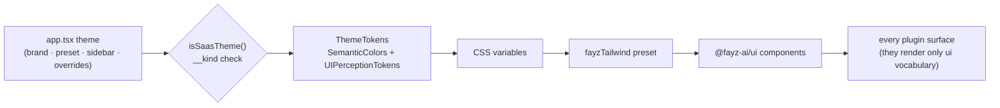

# THEMES — the theme contract and the design system as contract

Status: canonical · Updated: 2026-07-06
Owner-of-truth: `packages/ui/src/theme/` + `packages/saas/src/shell/config/theme/`

Theming is customization level 2: pure data, builder-editable, zero blast radius. The deeper rule this doc carries is Shopify's Polaris lesson ([BENCHMARKS.md](BENCHMARKS.md) §2.4): **the design system is a contract** — plugins render only the `@fayz-ai/ui` vocabulary, which is why a theme change (or a platform-wide restyle) propagates through every plugin and every third-party surface without breaking anything.

---

## 1. The theme contract

- **SaaS apps** — `defineSaas({ theme })` takes a `SaasTheme`: a `brand` HSL, optional `preset` (`FayzThemePresetId = 'classic_admin' | 'liquid_glass'`), a `sidebar` mode (`'neutral' | 'brand'` or explicit tokens — `deriveBrandSidebar` computes a readable rail from one brand HSL), and token overrides. Theme shapes are **discriminated, never duck-typed**: `__kind: 'saas-theme'` + `isSaasTheme()` (DECISIONS 2026-07-01).
- **Storefronts** — `createStorefront({ theme })` with the storefront presets (the volt/sertao template lineage) and section-level styling via block props.
- Resolution: theme → `ThemeTokens` (`SemanticColors` + `UIPerceptionTokens`) → CSS variables → Tailwind via `fayzTailwind`/`fayzUiPreset` → every component.

## 2. Tokens

Two token families (`packages/saas/src/shell/config/theme/tokens.ts`):

- **`SemanticColors`** — the full semantic palette (primary/secondary/accent + foregrounds, surfaces, destructive/success/warning, and the layout surface set: `sidebar*`, `content`). Themes set semantics; components never hardcode colors.
- **`UIPerceptionTokens`** — the feel: radii per component class (`buttonRadius`, `cardRadius`, `inputRadius`, `modalRadius`), font families. This is what makes `liquid_glass` vs `classic_admin` a one-line switch.

What a theme may change: any token. What it may not: layout structure, component behavior, information architecture — those are levels 3+ of the ladder ([CUSTOMIZATION.md](CUSTOMIZATION.md)).

## 3. The design system as contract

- Plugins consume **only** `@fayz-ai/ui` (DataTable, ModulePage, SubpageHeader, ModuleActionBar, primitives). Enforced: `scripts/check-plugin-patterns.mjs` fails a plugin rendering a raw `<table>` (`raw-table` rule) or hand-rolling a settings gear (`settings-gear` rule).
- Back-navigation is standardized app-wide via `SubpageHeader` ("← Back to {parent}").
- The payoff compounds when third-party plugins arrive: marketplace review can require the ui vocabulary ([MARKETPLACE.md](MARKETPLACE.md) §4 quality tiers), which is how third-party surfaces feel first-party — the Polaris effect.

## 4. Surfaces & personas

Adjacent to theming (what renders where, for whom):

- **Dashboard surfaces** — `DashboardSurface = 'home' | 'plugin-home' | 'finance-home'`; widgets declare `surfaces`, and shared-surface UI is opt-in or surface-scoped, never broadcast (the FAY-1247 rule).
- **Navigation scoping** — `CustomPage.nav: false` for mobile-only pages (routed, hidden from the desktop sidebar); bottom-nav declares the mobile world (DECISIONS 2026-07-03). The mobile-first shell (topbar→bottom-nav, responsive dashboard reflow) shipped in FAY-1237/1240.
- **One primary add action per module** — config picks quick-add (B2C) or the ERP "+ New" menu, never both (DECISIONS 2026-07-03) — a theming-adjacent rule the builder needs when configuring modules.
- **Persona engine** `[planned FAY-1249/1253]` — deriving `b2c | b2b` presentation defaults at `defineSaas` time (norman vs beauty from the same plugins). The hand-rolled `VITE_BEAUTY_PRESET=clinic` preset is kept as evidence input only, not deployed (DECISIONS 2026-07-02).
