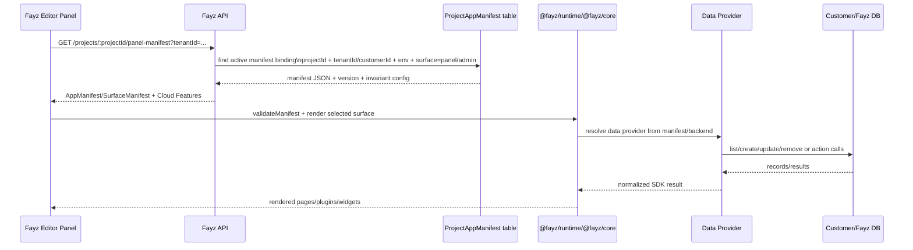
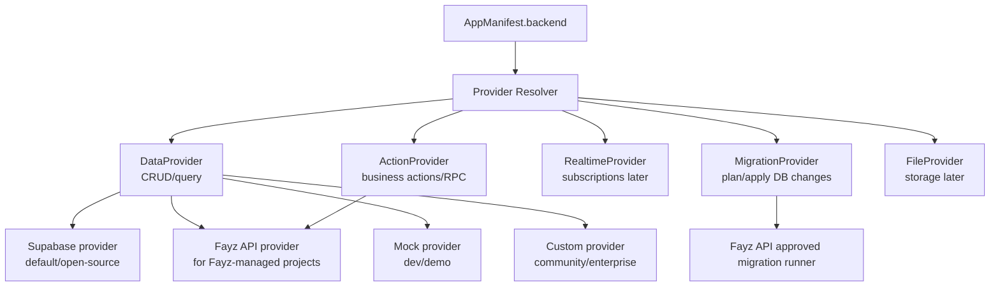
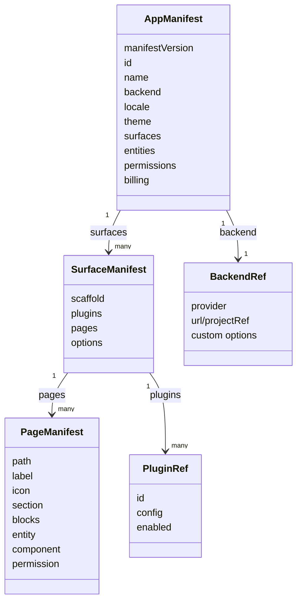
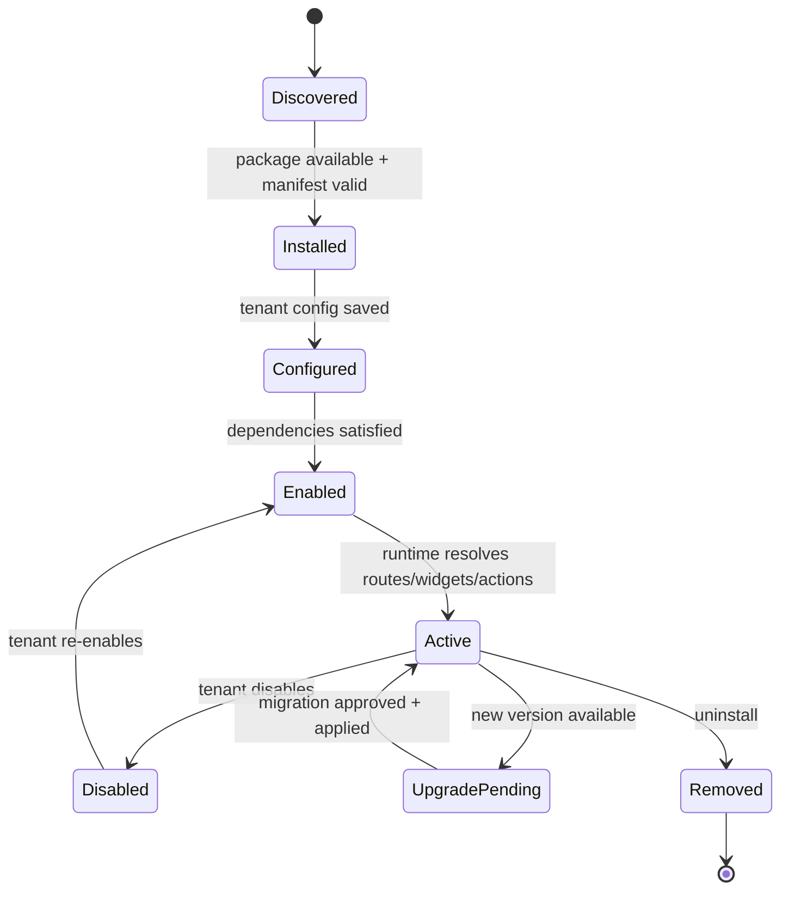
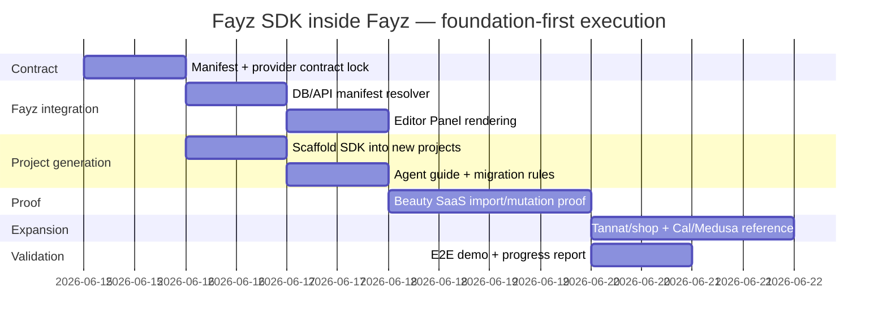
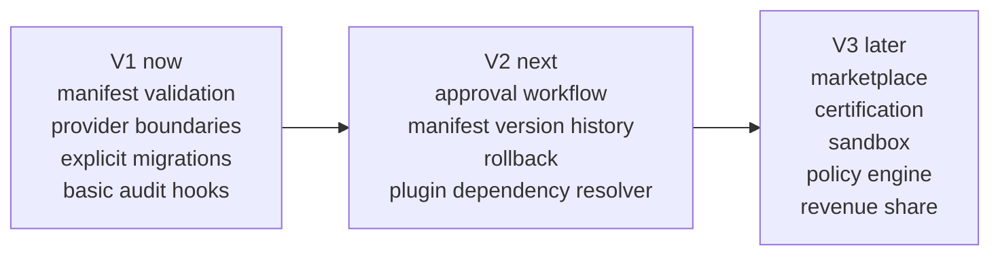

# 10 — Architecture Visuals

Mermaid diagrams for discussing the Fayz SDK / Fayz Core architecture before implementation.

## 1. Big picture: AI Builder → SDK → Runtime → Customer SaaS

```mermaid
flowchart TB
  User[Customer / Builder / Operator]
  AI[Fayz AI Builder + Coding Agents]
  Manifest[AppManifest JSON\nSDK-owned contract]
  FayzAPI[Fayz API\nmanifest resolver + project runtime APIs]
  Panel[Fayz Editor Panel\nhost-owned UI surface]
  Project[Generated Fayz Project\ncustomer SaaS repo/app]
  Runtime[@fayz/runtime\nmanifest -> app]
  Surfaces[Surfaces\nadmin / storefront / portal / panel]
  Providers[Providers\nSupabase / Fayz API / custom]
  DB[(Customer / Fayz DB)]
  Plugins[Plugins / Modules\nagenda, shop, inventory, financial]

  User --> AI
  AI --> Manifest
  Manifest --> FayzAPI
  FayzAPI --> Panel
  Manifest --> Project
  Project --> Runtime
  Runtime --> Surfaces
  Runtime --> Plugins
  Runtime --> Providers
  Providers --> DB
  Plugins --> Providers

  Panel -. host invariant sections .-> Cloud[Cloud Features\nDeploy / DB / Logs / Settings]
```

Core idea: **manifest is the language**, not the runtime. Fayz, generated projects, plugins, and agents all coordinate through the manifest contract.

## 2. Repo/package responsibility map

```mermaid
flowchart LR
  subgraph SDK[~/dev/fayz-sdk]
    Core[@fayz/core\ncontracts, manifest, data provider, registry, events]
    UI[@fayz/ui\ndesign tokens + primitives]
    Auth[@fayz/auth\nauth adapters/context]
    Saas[@fayz/saas\nadmin SaaS shell + CRUD pages]
    Runtime[@fayz/runtime\nrenderApp / manifest runtime glue]
    Storefront[@fayz/storefront\ncommerce surface shell]
    Shop[@fayz/shop\ncommerce domain primitives]
    Plugins[@fayz/plugin-*\nfeature modules]
    CLI[@fayz/cli\nfuture migration/import tooling]
  end

  subgraph Fayz[~/dev/fayz]
    Api[Fayz API\nprojects, imports, manifest storage, migrations]
    Web[Fayz Web Editor\nPanel tab + builder UI]
    AI2[packages/ai-v2\ngeneration vocabulary + agent guidance]
  end

  subgraph Apps[~/dev/fayz-app]
    Beauty[beauty-saas\nmain vertical proof]
    Resto[resto-saas\nrestaurant proof]
    Tannat[tannat-store\ncommerce proof]
  end

  Core --> Saas
  Core --> Runtime
  Core --> Plugins
  UI --> Saas
  UI --> Storefront
  Shop --> Storefront
  Plugins --> Apps
  Runtime --> Apps
  Api --> Web
  Web --> Runtime
  AI2 --> Core
  Apps -. imported/managed by .-> Api
```

Important separation: `fayz-sdk` owns the **open platform contracts/runtime packages**. `fayz` owns the **builder/editor/backend orchestration**. `fayz-app` holds **real generated/customer-like products**.

## 3. Manifest storage and tenant-specific Panel rendering



Architectural decision I recommend: DB stores **manifest bindings and versions**, not a new competing manifest shape. The SDK `AppManifest` remains canonical.

## 4. Provider abstraction: do not make a god provider



Pushback: if we put CRUD, auth, realtime, files, migrations, and AI actions into one interface, SDK v1 becomes fragile. Split provider capabilities and implement only what the current phase needs.

## 5. Manifest shape: app → surfaces → pages/plugins



The Panel should render one surface from the manifest. Later the same manifest can also describe admin/storefront/portal surfaces.

## 6. Plugin/module lifecycle



This lifecycle is why we need manifest/versioning/migrations early, but not a full marketplace yet.

## 7. Phase order



This is intentionally not “build every module first.” The correct proof is: **one manifest controls one real app surface, per tenant, safely.**

## 8. Governance path: now vs later



Do not skip governance, but also do not build SAP-scale controls before the Panel/Beauty proof works.
