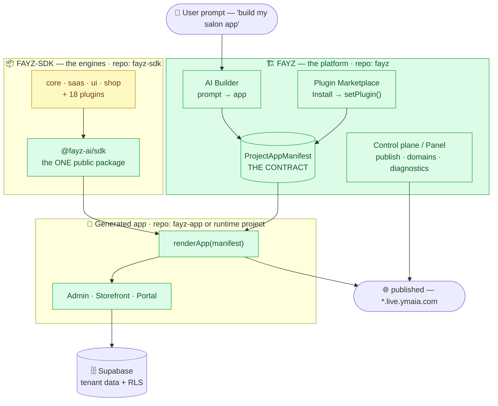
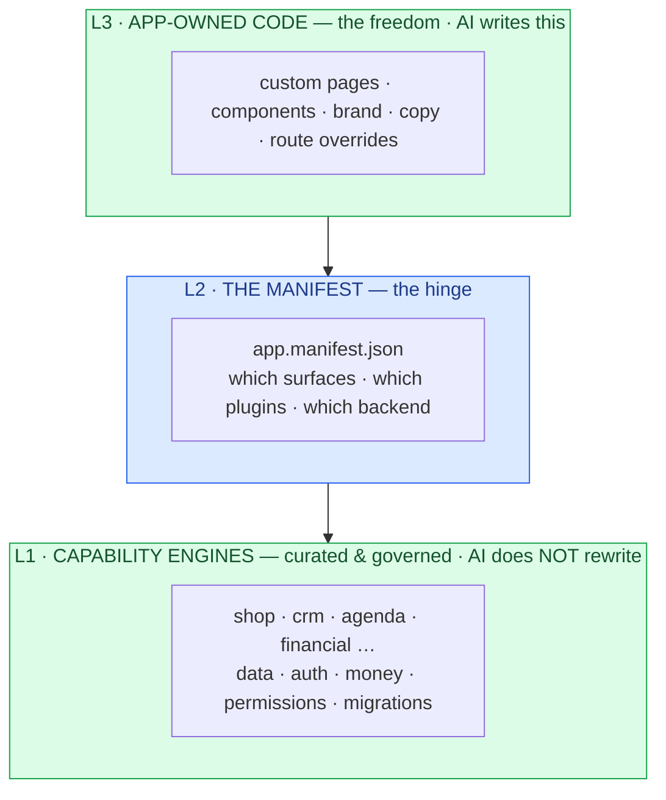
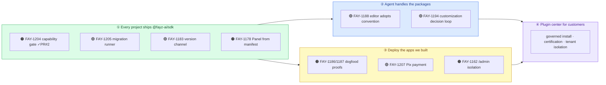
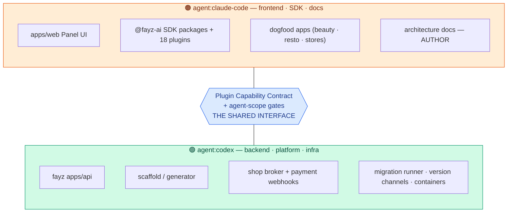

# ARCHITECTURE MAP — the picture, for humans

> A visual read of what we're building, how the pieces connect, and the road to ship it — so you can look at one page and confidently turn the AI queue loose. **2026-06-16.**
> Diagrams are [Mermaid](https://mermaid.live) — they render on GitHub, Linear, and VS Code. Deep detail lives in [STATE](STATE.md) · [PLUGIN-MODEL](PLUGIN-MODEL.md) · [RELEASE-PLAN](RELEASE-PLAN.md).

**How to read the colors:** 🟢 green = real & working · 🟡 amber = partial/in progress · 🔴 red = gap (has a ticket).

---

## If you read nothing else

Fayz is **three repos** with **one hinge** (the manifest). The AI builder writes freely on top; curated plugins provide governed power underneath; the manifest is where they meet. It's **further along than it feels** — the only thing not finished is making "install a plugin" actually provision a real backend. Everything in the road below exists to close that one seam and ship it safely, in order: **ship the SDK → teach the agent → deploy our apps → open the plugin center.**

---

## 1. The whole system on one screen

**In words:** A user prompts the **AI Builder**, which writes a **ProjectAppManifest** — the single contract that says *which surfaces, which plugins, which backend*. The **Marketplace** edits that same manifest when you install a plugin. The generated app calls `renderApp(manifest)`, pulls the engines via the one public package `@fayz-ai/sdk`, renders its surfaces, and reads/writes tenant data in Supabase. The platform publishes it to a live domain. The engines are amber because the plugin capability contract (their data half) is still being finished.

---

## 2. The hinge — how curated plugins stay flexible (not rigid)

**In words:** The AI gets Lovable-style freedom on the **top** layer (custom screens, brand). Plugins own the dangerous, repeated **bottom** layer (money, data, permissions) and the AI can't corrupt them. The **manifest** in the middle lets them meet. That's why adding curated plugins doesn't make it rigid — the freedom and the curation live on different layers.

---

## 3. What *should* happen when you install a plugin (and where it breaks today)

```mermaid
flowchart LR
  click["🛒 Click 'Install'"] --> flag["Manifest plugin ref flipped<br/>setPlugin()"]
  flag --> reg["Plugin factory registered<br/>plugins.generated.ts"]
  reg --> mig["Tables + RLS provisioned<br/>migration runner"]
  mig --> seed["Seed data inserted"]
  seed --> perm["Permissions enforced<br/>deny-by-default"]
  perm --> done["✅ Real governed capability live"]

  class click,flag,done ok
  class reg,mig,perm gap
  class seed part
  classDef ok fill:#dcfce7,stroke:#16a34a,color:#14532d
  classDef part fill:#fef9c3,stroke:#ca8a04,color:#713f12
  classDef gap fill:#fee2e2,stroke:#dc2626,color:#7f1d1d
```

| Step | Status | Ticket |
|---|---|---|
| Click Install → manifest flag flips | 🟢 works today | — |
| Plugin factory registered in the app | 🔴 stub | **FAY-1205** (SDK) → **FAY-1188** (editor) |
| Tables + RLS provisioned | 🔴 nothing applies the SQL | **FAY-1205** |
| Seed data inserted | 🟡 exists for some | rolls up to **FAY-1204** |
| Permissions enforced (deny-by-default) | 🔴 permissive today | **FAY-1204** |
| **The gate that proves all of the above** | 🟢 **landed (PR #2)** | **FAY-1204 / FAY-1206** |

**In words:** Today the chain works at the front (install flips the manifest) but breaks in the middle (nothing registers the plugin or provisions its tables). The whole capability-contract effort exists to turn this red chain green. **The measuring stick for "is it green" already shipped** — `check:plugin-capability` (PR #2).

---

## 4. The road — what to unblock, in order (this is the queue)

🟠 = Claude Code lane · 🟢 = Codex lane (see §5).

**Read the arrows as "must finish before":**
- **① unblocks everything.** It's where the SDK build + capability contract land.
- **② and ③ run in parallel** once ① is solid — different lanes, different files, no collision.
- **④ needs both ② and ③** — never open the marketplace to customers until apps deploy cleanly *and* the agent handles packages safely.
- The one rule baked into the board: **FAY-1188 (editor adopts the convention) is blocked by the dogfood proofs** — the generator never bakes in something we haven't proven on a real app first.

**The single gate before you trust step ③:** a freshly generated project must build against the **published** `@fayz-ai/sdk`, not local source aliases. Until that CI check is green, "every project ships the SDK" is true on paper only. That's milestone ①'s exit.

---

## 5. The two lanes — so two agents never collide

**In words:** The two lanes own **disjoint folders**, so they physically can't edit the same files. They meet only at the **capability contract**: Codex builds the runner/broker *behind* it, Claude Code builds the SDK/plugins/UI *in front* of it. The `check:fayz-sdk-agent-gates` scope gate enforces the boundary — a mislabeled ticket fails the gate instead of corrupting the other lane. **All frontend tickets go to Claude Code.** Both lanes read these docs; only Claude Code edits them.

---

## How to use this when you turn on the queue

1. **Point both agents at milestone ①.** Filter Linear by `agent:codex` / `agent:claude-code` + milestone "1 · Every project ships @fayz-ai/sdk". Each agent eats its own lane.
2. **Watch the one gate:** a generated project building against the published package. That's the green light to start ③.
3. **Don't let ④ open early.** It's gated on ②+③ by design — the board enforces it via blockers.
4. **When you feel lost:** come back to §4 (the road) — it's the whole plan in one diagram. Every ticket on the board sits in one of those four boxes.
