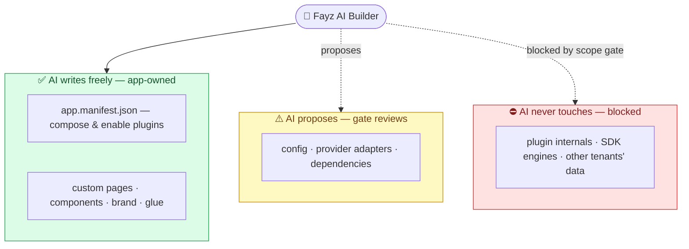
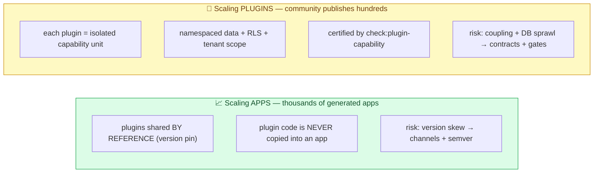
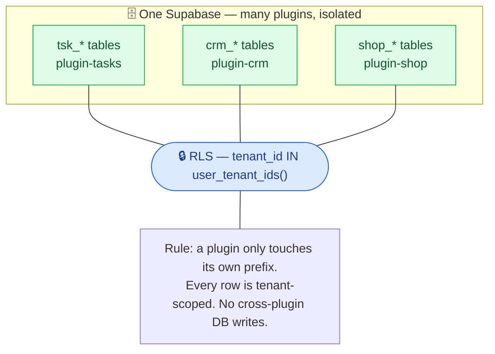
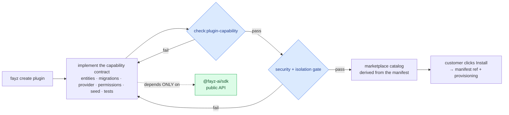
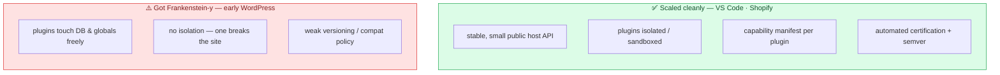

# PLUGIN-ECOSYSTEM — will this scale, or become a Frankenstein?

> An honest stress-test of the plugin concept on an AI builder: does it work, does it scale, how do outsiders publish, and how we avoid a maintenance monster. **2026-06-16.**
> Companion: [PLUGIN-MODEL](PLUGIN-MODEL.md) (the contract), [ARCHITECTURE-MAP](ARCHITECTURE-MAP.md) (the picture), [RELEASE-PLAN](RELEASE-PLAN.md) (the road).

---

## The honest verdict up front

**Your worry is correct, and it's containable.** A plugin ecosystem on an AI builder *will* become a Frankenstein if it's left loose — that's the default outcome, not a tail risk. But the same model, with strict **isolation + contracts + machine-enforced gates**, is exactly how VS Code (50k+ extensions) and Shopify (10k+ apps) scaled without collapsing. The ones that got messy (early WordPress) shared one thing: **weak isolation and a database free-for-all.**

So the real statement isn't "plugins are risky." It's: **the discipline has to be enforced by gates, not by good intentions** — because an AI is generating both the apps and (eventually) the plugins, and an AI will absolutely take the shortcut if a gate doesn't stop it. We already have two of the load-bearing gates. We're missing three. This doc names all of them honestly.

---

## 1. Does the concept even work on an AI builder?

The fear: AI builders generate arbitrary code (Lovable); plugins are curated units. Won't the AI just rewrite/copy plugin code and dissolve the curation? **Only if we let it.** The defense is a hard boundary on *what the AI is allowed to touch:*

**This already exists and is enforced** — `check:fayz-sdk-agent-gates` classifies every file an AI edit touches as *app-owned / review / blocked*, and the run is rejected if it writes a blocked file. The dogfood proofs show the AI refusing to edit `src/plugins/**`. So: the concept works **because the AI composes plugins via the manifest and writes glue — it does not author plugin internals.** That's the difference between "AI builder + curated plugins" and "AI rewrites everything every time."

---

## 2. The two scaling axes (they scale very differently)

- **Scaling apps is the easy axis** (green). 10,000 apps using `plugin-shop` all point at *one* versioned package. Nothing is copied, so there's no duplication to maintain. The only risk is version skew, solved by version channels (FAY-1183) + semver discipline.
- **Scaling plugins is the hard axis** (amber). This is where Frankenstein lives. 300 community plugins only stay sane if each is an **isolated unit** that can't reach into other plugins, other tenants, or the host — enforced, not requested.

The maintenance-mess fear is really a fear about the **second axis**. The rest of this doc is about containing it.

---

## 3. The #1 Frankenstein risk: the shared database

Every plugin wants tables. 200 plugins in one Supabase is exactly how WordPress got messy — plugins writing wherever they liked. Our defense is **namespace + tenant isolation, by convention today, by gate tomorrow:**

The convention is **already in the code** (`tsk_labels`, `shop_products`, `crm_*`), and migrations ship RLS policies keyed on `tenant_id`. What's **missing** is a gate that *enforces* "a plugin's migrations may only create/alter tables under its own prefix, and every table must be tenant-scoped + RLS-protected." Until that gate exists, a sloppy (or AI-written) plugin could still write outside its lane. **That gate is the single most important thing to build before opening the marketplace to outsiders.**

---

## 4. How a developer publishes a plugin (and why it integrates cleanly)

The integration is "smooth" for one reason: **a community plugin depends only on `@fayz-ai/sdk`'s public API** — never on internal packages, never on the host's guts. That's the stable contract VS Code and Shopify both rely on. The plugin targets a small, versioned surface; the host can refactor everything behind it without breaking the plugin. **Certification = passing the gates**, not human review — that's what makes it scale to hundreds of authors. Two of these gates exist (`check:plugin-capability`, `check:plugin-patterns`); the **security + isolation gate (g2) does not yet** — it's the gate from §3 plus a check that the plugin holds no secrets and calls the broker for provider access.

---

## 5. The anti-Frankenstein control panel (honest status)

Each maintenance-mess risk, the mechanism that contains it, and whether it's actually enforced today. **This is the real answer to "how do we avoid the mess" — and where we're still exposed.**

| Frankenstein risk | The guardrail | Status |
|---|---|---|
| 100 plugins, 100 visual dialects | `check:plugin-patterns` — shared UI primitives | ✅ **enforced** |
| Plugins that are demos, not real capabilities | `check:plugin-capability` — data/perm/migration contract | 🟡 **landed, 1/18 enforced** (ratcheting) |
| AI corrupts a plugin / copies its code into apps | `check:fayz-sdk-agent-gates` — app-owned/blocked scope | ✅ **enforced** |
| Database sprawl (plugins writing anywhere) | table-prefix + tenant + RLS, **gate-enforced** | 🔴 **convention only — no gate** |
| One tenant reads another's data | RLS keyed on `tenant_id` | 🟡 **present where migrations exist, not universally checked** |
| Version skew across thousands of apps | version channels + semver + published-build CI | 🔴 **drift exists; CI not enforcing published build** |
| Plugins tangled into each other | manifest dependencies + topo-sort + cycle detection | 🟡 **runtime detects cycles; cross-plugin *data* coupling uncontracted** |
| A broken plugin takes down the whole app | blast-radius isolation (plugin fails → disables itself) | 🔴 **not yet — a plugin throw can break the shell** |
| Plugin A reaches into plugin B at runtime | communicate via events, not imports | 🟡 **events exist in the manifest; discipline not enforced** |
| Community plugin quality / safety | certification = the gates above, automated | 🔴 **not built (community submission absent)** |

**Reading this honestly:** the *app-facing* discipline is strong (UI, scope, capability contract). The *ecosystem-facing* discipline — the stuff you only need when **outsiders** publish — is mostly 🔴/🟡. That's fine, because the release plan doesn't open the marketplace to customers until **step ④**, and these red rows are precisely ④'s entry gate. The danger would be opening ④ early. The board's blockers prevent that.

---

## 6. The precedent — am I considering the bigger picture?

You asked if you're being pessimistic or if I'm missing something. Here's the bigger picture, from ecosystems that already ran this experiment at scale:

The dividing line is **isolation + a stable contract + enforced certification.** Fayz's design is on the winning side *by intent* — manifest-declared capabilities, one public SDK surface, namespaced data, the gates. The risk is purely **execution discipline**: every guardrail that's a 🔴 in §5 is a place where, under deadline pressure and AI shortcuts, we could slide toward the WordPress column. The way you stay in the VS Code column is boring and non-negotiable: **a plugin can't ship to customers until it passes the gates, and the gates are code, not vibes.**

---

## What must be true before the plugin center opens to customers (step ④)

These are the 🔴 rows, turned into the non-negotiables. (Not auto-creating tickets — flagging them so *you* decide when they enter the queue.)

1. **Isolation gate** — a plugin's migrations may only touch its own table prefix; every table is tenant-scoped + RLS-protected; the plugin holds no secrets. *(extends `check:plugin-capability`)*
2. **Blast-radius isolation** — a plugin that throws disables itself and surfaces an error; it never crashes the host shell or other plugins.
3. **Published-build CI** — a generated app builds against the *published* `@fayz-ai/sdk`, so version skew is caught before customers feel it. *(this is also milestone ①'s gate)*
4. **Cross-plugin contract** — plugins interact through declared events, never by importing each other; a gate flags direct cross-plugin imports.
5. **Certification pipeline** — community submission runs all gates + a security review automatically; passing = listed.

Do these five and the ecosystem scales like VS Code's. Skip them and your instinct is right — it becomes a monster. The architecture is sound; the discipline is the product.
